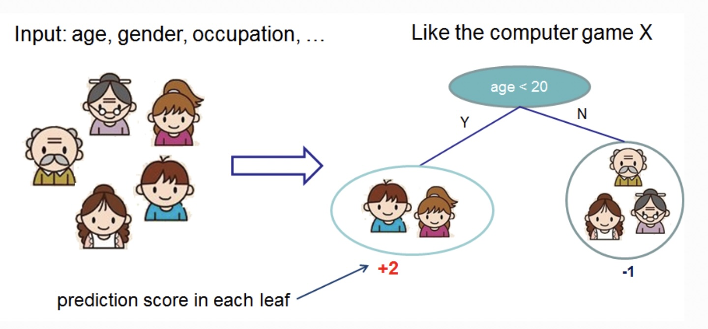
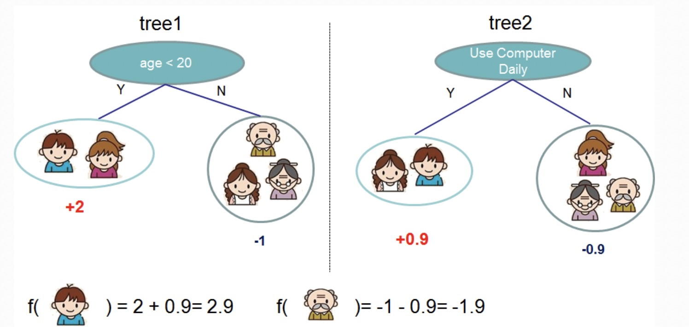
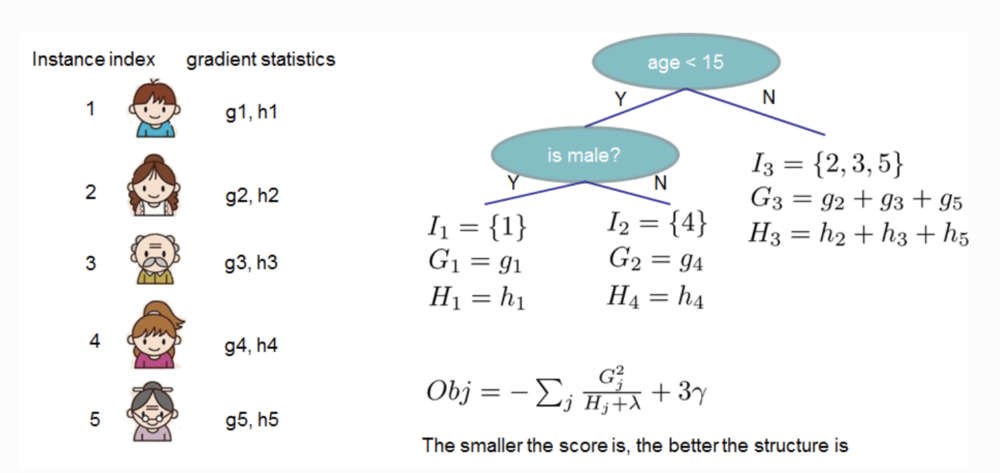

## R Packages for This Lecture

Beyond the packages you have installed already, you should install

- `xgboost` for extreme gradient boosting

# Boosted Trees {background-color="#40666e"}

## What Does a Single Tree Do?

::::: columns
::: {.column width="50%"}
{fig-align="center"}

Source: DMLC
:::

::: {.column width="50%"}
- We fit a CART resulting in a prediction $\hat{y}_i$ for the instances.

- This is just the average score in the leaf.
:::
:::::

## How Do We Boost Trees?

::::: columns
::: {.column width="50%"}
{fig-align="center"}

Source: DMLC
:::

::: {.column width="50%"}
- A new tree is added to improve predictions.

- Each tree models the residuals (errors) of the previous model.
:::
:::::

## What Are We Optimizing?

- For trees $f_k \in {\cal F}$, where ${\cal F}$ is the set of all possible CARTs,

$$\hat{y}_i = \sum_{k=1}^K f_k(\boldsymbol{x}_i)$$

- The objective function we seek to minimize consists of a loss component $L$ and a penalty for complexity:

$$\text{obj}(\boldsymbol{\theta}) = \sum_{i=1}^{n} L(y_i,\hat{y}_i) + \sum_{k=1}^K \omega(f_k)$$

## Additive Training

- Boosting builds trees sequentially.

- At step $t$, previous trees $f_1, \dots, f_{t-1}$ are fixed; we only optimize the new tree $f_t$:

$$\text{obj}^{(t)} = \sum_{i=1}^{n} L \left( y_i, \hat{y}_i^{(t-1)} + f_t(\boldsymbol{x}_i) \right) + \omega(f_t) + \text{constant}$$

- Goal: Find $f_t$ that minimizes the overall loss plus tree complexity.

## Sequence of Predictions

1.  Initial prediction $\hat{y}_i^{(0)} = 0$.

2.  At $t=1$, $\hat{y}_i^{(1)} = f_1(\boldsymbol{x}_i) = \hat{y}_i^{(0)} + f_1(\boldsymbol{x}_i)$.

3.  At $t=2$, $\hat{y}_i^{(2)} = f_1(\boldsymbol{x}_i) + f_2(\boldsymbol{x}_i) = \hat{y}_i^{(1)} + f_2(\boldsymbol{x}_i)$.

4.  Continuing the process, we get

$$\hat{y}_i^{(t)} = \sum_{k=1}^t f_k (\boldsymbol{x}_i) = \hat{y}_i^{(t-1)} + f_t (\boldsymbol{x}_i)$$

## Example: Exact Quadratic Loss

- If $L(y_i, \hat{y}_i) = (y_i - \hat{y}_i)^2$, expanding $\text{obj}^{(t)}$ gives:

$$\begin{align}     \text{Obj}^{(t)} &= \sum_{i=1}^{n} \left( y_i - \left[ \hat{y}_i^{(t-1)} + f_t (\boldsymbol{x}_i) \right] \right)^2 + \omega(f_t) + \text{constant} \\     &= \sum_{i=1}^{n} \left[ 2 \underbrace{\left( \hat{y}_i^{(t-1)} - y_i\right)}_{r_i} f_t (\boldsymbol{x}_i) + f_t (\boldsymbol{x}_i)^2 \right] + \omega(f_t) + \text{constant}     \end{align}$$

- What if $L$ is logistic loss, Huber loss, or a custom loss? We need a universal approximation!

## Why Second-Order Taylor Expansion?

- Standard Taylor expansion around base point $x$:

$$g(x + \Delta x) \approx g(x) + g'(x)\Delta x + \frac{1}{2}g''(x)(\Delta x)^2$$

- Mapping to XGBoost at step $t$:

  - Base point $x$: Current prediction $\hat{y}_i^{(t-1)}$ (known/fixed).

  - Step $\Delta x$: New tree prediction $f_t(\boldsymbol{x}_i)$ (what we solve for).

  - Function $g$: Loss function $L(y_i, \cdot)$.

- Key Benefit: Universal optimization for any smooth loss function!

## Applying the Taylor Expansion

- Expanding the loss around $\hat{y}_i^{(t-1)}$:

$$L\left(y_i, \hat{y}_i^{(t-1)} + f_t(\boldsymbol{x}_i)\right) \approx L\left(y_i, \hat{y}_i^{(t-1)}\right) + g_i f_t(\boldsymbol{x}_i) + \frac{1}{2} h_i f_t^2 (\boldsymbol{x}_i)$$

- Here the first and second derivatives are:

  - Gradient: $g_i = \frac{\partial L(y_i, \hat{y}_i^{(t-1)})}{\partial \hat{y}_i^{(t-1)}}$

  - Hessian: $h_i = \frac{\partial^2 L(y_i, \hat{y}_i^{(t-1)})}{\partial^2 \hat{y}_i^{(t-1)}}$

## Applying the Taylor Expansion Cont'd

- Dropping constants, our objective at step $t$ simplifies to:

$$\text{obj}^{(t)} \approx \sum_{i=1}^{n} \left[ g_i f_t(\boldsymbol{x}_i) + \frac{1}{2} h_i f_t^2 (\boldsymbol{x}_i) \right] + \omega(f_t)$$

## How to Penalize Over-Fitting?

- Define regularization for a tree $f(x)$:

$$\omega(f) = \gamma \vert{}T\vert{} + \frac{1}{2} \lambda \sum_{j=1}^{\vert{}T\vert{}} w_j^2$$

- Where:

  - $\vert{}T\vert{}$ is the total number of leaves (penalized by $\gamma$).

  - $w_j$ are the leaf output scores (L2 penalized by $\lambda$).

  - Acts like Elastic Net regularization directly on tree structure.

## Structure Score

- Define $f_t(\boldsymbol{x}) = w_{q(\boldsymbol{x})}$, where $w$ are leaf scores and $q(\boldsymbol{x})$ assigns instance $i$ to leaf $j$.

- Group instances by leaf $I_j = \{i \mid q(\boldsymbol{x}_i) = j\}$:

$$\text{Obj}^{(t)} \approx \sum_{j=1}^{\vert{}T\vert{}} \left[ \left( \sum_{i \in I_j} g_i \right) w_j + \frac{1}{2} \left( \sum_{i \in I_j} h_i + \lambda \right) w_j^2 \right] + \gamma \vert{}T\vert{}$$

- Letting $G_j = \sum_{i \in I_j} g_i$ and $H_j = \sum_{i \in I_j} h_i$:

$$\text{Obj}^{(t)} \approx \sum_{j=1}^{\vert{}T\vert{}} \left[ G_j w_j + \frac{1}{2} (H_j + \lambda) w_j^2 \right] + \gamma\vert{}T\vert{}$$

## Optimums

- Taking derivative w.r.t. $w_j$, the optimal leaf weights are:

$$w_j^* = - \frac{G_j}{H_j + \lambda}$$

- Substituting $w_j^*$ back gives the optimal objective (Structure Score):

$$\text{Obj}^* = -\frac{1}{2} \sum_{j=1}^{\vert{}T\vert{}} \frac{G_j^2}{H_j + \lambda} + \gamma\vert{}T\vert{}$$

- $\text{Obj}^*$ measures how "good" a given tree structure is (smaller is better).

## Visualizing Tree Quality

{fig-align="center"}

## Splitting on Features

- Gain from splitting a leaf into Left ($L$) and Right ($R$) branches:

$$\text{IG} = \frac{1}{2} \left[ \frac{G_L^2}{H_L + \lambda} + \frac{G_R^2}{H_R + \lambda} - \frac{\left( G_L + G_R \right)^2}{H_L + H_R + \lambda} \right] - \gamma$$

- $\gamma$ acts as a threshold: if $\text{IG} < 0$ (i.e. gain $< \gamma$), the split is pruned.

## Efficient Split Finding

::::: columns
::: {.column width="62%"}
**Exact Greedy Search:**

- Sort instances by feature value $x_{i,k}$.

- Scan left-to-right, maintaining running sums:

  - $$G_L \leftarrow G_L + g_i, \quad H_L \leftarrow H_L + h_i$$

  - $$G_R = G_{\text{total}} - G_L, \quad H_R = H_{\text{total}} - H_L$$

- Evaluate $\text{IG}$ in $O(1)$ per candidate split point.
:::

::: {.column width="38%"}
**Computational Efficiency:**

- Naive: $O(n^2)$ per feature (re-summing leaves from scratch).

- Exact Greedy: $O(n \log n)$ due to initial sorting; $O(n)$ linear sweep.

- Histogram (tree_method = 'hist'): Bins features into $B$ buckets ($\approx 256$). Evaluates splits in $O(B)$ time!
:::
:::::

# Tuning XGBoost {background-color="#40666e"}

## Hyperparameter Taxonomy and Math Mapping

| Parameter | Symbol | Role | Impact/Guidance                              |
|:--------------------|:----|:-----------------------|:-----------------------|
|`learn_rate`|$\eta$|Step-size shrinkage|Small (0.01–0.1) prevents overfitting|
|`tree_depth`|---|Max tree depth|Keep low (3–7) to limit interactions|
|`min_n`|$\sum h_i$|Min sum of Hessians|Prevents fitting noise in small leaves|
|`loss_reducion`|$\gamma$|Split threshold|Minimum gain required to split|
|`reg_lambda`|$\lambda$|L2 leaf score penalty|Higher values shrink weights $w_j^*$|
|`sample_size`/`mtry`|---|Subsampling ratios|Adds randomness (bagging / RF style)|

## Tree-Specific Parameters

- `tree_depth`: Maximum depth of a tree (controls model complexity).
- `sample_size`: Subsample ratio of training instances.
- `mtry`: Subsample ratio of columns when constructing each tree.
- `min_n`: Minimum sum of instance weight (Hessian) needed in a child.

## General and Regularization Parameters

- `learn_rate` ($\eta$): Scales individual tree contributions: $\hat{y}^{(t)} = \hat{y}^{(t-1)} + \eta f_t(\boldsymbol{x})$.
- `trees` (nrounds): Total number of boosting iterations.
- `loss_reduction` ($\gamma$) & reg_lambda ($\lambda$): Tree structure penalties.

## Why Tuning Matters

- XGBoost performance depends heavily on good hyperparameter choices.

- Tuning can be time-consuming but yields strong models.

## Smarter Tuning Strategies

- Bayesian Optimization [@NIPS2012_05311655; @shahriari2016Taking]

    - Efficient.

    - Informed by previous results.

- Simulated Annealing [@kirkpatrick1983Optimization]

    - Global search.

    - Accepts occasional worse moves to escape local minima.

## Smarter Tuning: Bayesian Optimization

- Instead of blindly searching, we model the performance surface.

- Use a surrogate model to pick the next best set of parameters.

- Balances:

  - Exploration (trying new areas)

  - Exploitation (refining the best-known areas)

## Global Search: Simulated Annealing

- Start with random hyperparameters.

- Gradually refine by allowing occasional 'bad' moves.

- Useful to escape local optima.

- Less popular in ML compared to Bayesian Optimization, but conceptually interesting.

> Think of it like "cooling" toward a good solution.

# Case Study: Boston Housing {background-color="#40666e"}

## Sampling and Workflow

::: panel-tabset
### Data

```{r}
#| echo: true
#| message: false
library(mlbench)
library(tidyverse)
library(tidymodels)
tidymodels_prefer()
data("BostonHousing2")
df <- BostonHousing2 %>%
  mutate(chas = as.numeric(chas)) %>%
  select(-town, -tract, -lon, -lat, -medv)
set.seed(821)
data_split <- initial_split(df, prop = 0.9, strata = cmedv)
train_data <- training(data_split)
test_data <- testing(data_split)
```

### Recipe

```{r}
#| echo: true
xgb_recipe <- recipe(cmedv ~ ., data = train_data) %>%
  step_normalize(all_numeric_predictors())
```

### Specification

```{r}
#| echo: true
xgb_spec <- boost_tree(
  trees = 1000,
  tree_depth = tune(),
  min_n = tune(),
  loss_reduction = tune(),
  sample_size = tune(),
  mtry = 5,
  learn_rate = tune()
) %>%
  set_engine("xgboost") %>%
  set_mode("regression")
```

### Flow

```{r}
#| echo: true
xgb_workflow <- workflow() %>%
  add_model(xgb_spec) %>%
  add_recipe(xgb_recipe)
```
:::

## Tuning with Bayesian Optimization

::: panel-tabset
### Folds

```{r}
#| echo: true
set.seed(123)
cv_splits <- vfold_cv(train_data, v = 10)
```

### Execution

```{r}
#| echo: true
doParallel::registerDoParallel()
xgb_tune_results <- tune_bayes(
  xgb_workflow,
  resamples = cv_splits,
  initial = 10,
  iter = 50,
  control = control_bayes(verbose = TRUE)
)
```

### Optimal

```{r}
#| echo: true
best_params <- select_best(xgb_tune_results)
best_params
```
:::

## Final Flow and Performance

::: panel-tabset
### Finalize

```{r}
#| echo: true
final_xgb_workflow <- finalize_workflow(
  xgb_workflow,
  best_params
)
final_xgb_fit <- fit(final_xgb_workflow, data = train_data)
```

### Evaluate

```{r}
#| echo: true
xgb_predictions <- predict(final_xgb_fit, new_data = test_data) %>%
  bind_cols(test_data)
xgb_metrics <- xgb_predictions %>%
  metrics(truth = cmedv, estimate = .pred)
print(xgb_metrics)
```

### Visualization

```{r}
xgb_predictions %>%
  ggplot(aes(x = cmedv, y = .pred)) +
  geom_point(alpha = 0.5) +
  geom_abline(slope = 1, intercept = 0, linetype = "dashed") +
  labs(title = "Predicted vs Actual", x = "Actual", y = "Predicted")
```
:::

## References
