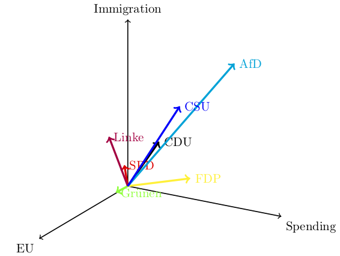
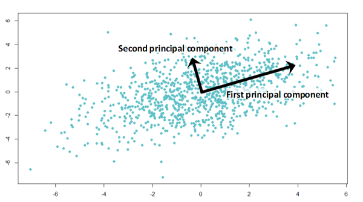
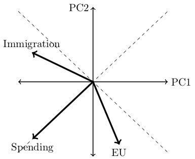

## R Packages

- `missMDA` for cross-validation.

- `psych` for parallel analysis, rotation, and component scores.

# Objective {background-color="#40666e"}

## What Is Principal Component Analysis?

::::: columns
::: {.column width="50%"}
- Principal component analysis (PCA) is a data reduction technique first introduced by @pearson1901Lines:

  - We reduce the effective number of variables

- Consider the placement of German political parties on three issues $\rightarrow \mathbb{R}^3$.

- Is there a $\mathbb{R}^2$ or $\mathbb{R}^1$ space that adequately accounts for the data?
:::

::: {.column width="50%"}
{fig-align="center"}
:::
:::::

## What Does PCA Accomplish?

:::::: columns
:::: {.column width="50%"}
{fig-align="center"}

::: {style="font-size: 75%"}
**Source:** [Analytics Vidhya](https://www.analyticsvidhya.com/blog/2016/03/pca-practical-guide-principal-component-analysis-python/)
:::
::::

::: {.column width="50%"}
Transform a set of correlated features into a smaller set of [**principal components**]{.alert} with the following properties:

1.  They are orthogonal.
2.  They are extracted in the order of the variance for which they account.
:::
::::::

# The Mathematics of PCA {background-color="#40666e"}

## Spectral Decomposition

::: panel-tabset
## Math

For a $P \times P$ covariance matrix $\boldsymbol{S}$, we perform the spectral decomposition

$$\boldsymbol{S} = \boldsymbol{C} \boldsymbol{L} \boldsymbol{C}^\top = \sum_{j=1}^P \lambda_j \boldsymbol{c}_j \boldsymbol{c}_j^\top$$

Here,

- $\boldsymbol{L}$ is a diagonal matrix of eigenvalues, whose elements are $\lambda_j$.

- $\boldsymbol{C}$ is a $P \times P$ orthogonal matrix of [**eigenvectors**]{.alert}, whose rows correspond to the features and whose columns correspond to the components. Each column has unit length.

- The [**loadings**]{.alert} are the eigenvectors rescaled by the square root of their eigenvalues, $\boldsymbol{\Lambda} = \boldsymbol{C} \boldsymbol{L}^{1/2}$. These---not $\boldsymbol{C}$---are what we interpret and rotate.

## Data

```{r}
#| echo: true
german_df <- data.frame(
  EU = c(6.38,6.38,5.69,6.23,3.00,4.85,1.62),
  spending = c(5.73,3.45,7.36,2.82,0.50,6.18,7.89),
  immigration = c(5.73,3.91,3.60,2.09,4.00,7.45,9.30)
)
row.names(german_df) <- c("CDU", "SPD", "FDP", "Gruenen", "Linke", "AfD",
                          "CSU")
S <- cov(german_df)
S
```

## Decomposition

```{r}
#| echo: true
sd <- eigen(S)
sd
```
:::

## Total Variance and Variance Accounted For

- The [**total variance**]{.alert} is the diagonal sum over $\boldsymbol{S}$: $\sum_{j=1}^P s_{jj}$.
- Mathematically, $\sum_{j=1}^P \lambda_j = \sum_{j=1}^P s_{jj}$.
- Thus, the $i$th component accounts for $100 \cdot \frac{\lambda_i}{\sum_j s_{jj}}$ percent of the total variance.

## PCA as a Model

- Principal components are linear composites.

- Specifically, unit $i$'s score on the $m$th component is

  $$p_{im} = \sum_{j=1}^P w_{jm} \cdot x_{ij}$$

  where $w_{jm}$ is the weight attached to feature $j$ by component $m$.

- For the unrotated solution these weights are just the elements of the $m$th eigenvector. Using the covariance decomposition above, a German party's score on the 1st component is $0.292 \cdot \text{EU} - 0.672 \cdot \text{spend} - 0.680 \cdot \text{immigration}$.

## Contrast with Factor Analysis

::::: columns
::: {.column width="50%"}
```{mermaid}
%%| echo: false
%%| fig-width: 4
graph TD
  subgraph Principal Components
  X1((x1)) --> C((COMP))
  X2((x2)) --> C
  X3((x3)) --> C
  end
```
:::

::: {.column width="50%"}
```{mermaid}
%%| echo: false
%%| fig-width: 4
graph TD
  subgraph Factor Analysis
  F((FACTOR)) --> X1((x1))
  F --> X2((x2))
  F --> X3((x3))
  E1((e1)) --> X1
  E2((e2)) --> X2
  E3((e3)) --> X3
  end
```
:::
:::::

## Covariance versus Correlation

- We used the covariance matrix to explain the idea of total variance.

- In general, PCAs are run on correlation matrices to accommodate differences in measurement scales.

- From now on, we shall follow suit.

- *Note:* For a correlation matrix, the total "variance" is equal to $P$.

## Implementation in R

::: panel-tabset
## Syntax

```{r}
#| echo: true
# Can be done from raw data. Here, we standardize,
pca_fit <- prcomp(german_df, center = TRUE, scale. = TRUE)
```

## Result

```{r}
#| echo: true
pca_fit$rotation
```
:::

# PCA and Data Reduction {background-color="#40666e"}

## Back to the Original Goal

- The spectral decomposition extracts as many components as there are variables.

- If we are willing not to recover the total variance, however, it is possible to extract $M < P$ components.

- This data reduction serves several purposes

  - Can be used to reduce model complexity by combining features (`step_pca` in a `tidymodels` recipe).

  - Reveals connections among variables $\rightarrow$ new insights.

- The practical question is how to choose $M$.

## Choosing $M$

- Different methods are available:

  1.  Variance explained.
  2.  Eigenvalues.
  3.  Scree plot
  4.  Parallel analysis
  5.  Cross-validation

- Best used with standardized features.

## Variance Explained

::: panel-tabset
## Logic

- Components are extracted in the order of total variance they account for.

- Together, $P$ components account for 100% of the total variance.

- Often we are satisfied with 95% of the variance explained $\rightarrow$ we can drop components.

## Result

```{r}
#| echo: true
summary(pca_fit)
```

Together the first two components account for 95% of the variance. Do we really need to retain the third component? If not $\mathbb{R}^3 \rightarrow \mathbb{R}^2$.
:::

## Eigenvalue Cutoffs

::: panel-tabset
## Logic

- @kaiser1960Application argued that we should reference the average eigenvalue of a correlation matrix, which is 1.

- Hence $\lambda_j > 1$ is used to select the number of components.

- @jolliffe2002Principal sets a more lenient cutoff of 0.7.

## Implementation

```{r}
summary(pca_fit)
```

Kaiser: Retain one component.

Jolliffe: Retain two components.
:::

## Screeplot

::: panel-tabset
## Logic

- @cattell1966Scree introduced the screeplot: plot components on the $x$ axis and eigenvalues on the $y$-axis.

- Look for the elbow in the plot: fast drop makes places for shallower drops $\rightarrow$ additional components do not add all that much.

## Syntax

```{r}
#| echo: true
#| eval: false
screeplot(pca_fit)
```

## Result

```{r}
screeplot(pca_fit)
```
:::

## Parallel Analysis

::: panel-tabset
## Logic

- @horn1965Rationale proposed parallel analysis,

- Simulates random data matrices of identical dimensions ($n \times p$) drawn from uncorrelated standard normal distributions.

- *Decision Rule:* Compare the observed eigenvalues to the average (or 95th percentile) eigenvalues generated from the simulated random data. Retain components whose empirical eigenvalues strictly exceed the simulated values.

- *Caveat:* Our example has $n = 7$ and $p = 3$, which is far too small. The simulation is not identified, `fa.parallel` returns 0 components, and it warns about a Heywood case. Read the next tab as a demonstration of syntax, not as evidence about $M$.

## Syntax

```{r}
#| echo: true
#| eval: false
library(psych)
fa.parallel(cor(german_df), n.obs = 7, fa = "pc")
```

## Result

```{r}
#| message: true
#| warning: false
suppressPackageStartupMessages(library(psych))
fa.parallel(cor(german_df), n.obs = 7, fa = "pc")
```
:::

## Cross-Validation

::: panel-tabset
## Logic

- @josse2012Selecting and @wold1978CrossValidatory propose cross-validation for selecting $M$.

- *Method:* Treat PCA as a matrix approximation problem. Withhold a fraction of elements or rows, fit PCA on the remaining data using $M$ components, and evaluate the reconstruction error (e.g., PRESS - Predicted Residual Error Sum of Squares) on the held-out values.

- *Decision Rule:* Select $M$ that minimizes the cross-validation reconstruction error or uses the "one standard error rule."

## Syntax

```{r}
#| echo: true
#| eval: false
library(missMDA)
cv_res <- estim_ncpPCA(german_df,
                       ncp.min = 1, ncp.max = 3,
                       method.cv = "Kfold")
cv_res$ncp
```

## Results

```{r}
#| message: false
library(missMDA)
cv_res <- estim_ncpPCA(german_df,
                       ncp.min = 1, ncp.max = 3,
                       method.cv = "Kfold")
cv_res$ncp
```
:::

## Where Does This Leave Us

- Nearly all criteria suggest that we need $M = 2$ components.

- Kaiser's criterion is the one substantive dissent: it retains a single component.

- Parallel analysis casts no vote at all---at $n = 7$ it is not identified.

# Interpreting Components {background-color="#40666e"}

## Rotation

::::: columns
::: {.column width="50%"}
- We can use the loadings to make sense of the principal components.

- However, the loadings are *not* unique.

- We can account for the same portion of $T$ through arbitrary orthogonal transformations of $\boldsymbol{C}$ that we call [**rotations**]{.alert}.

- Rotation is our friend---a carefully selected rotation can simplify the interpretation.
:::

::: {.column width="50%"}
{fig-align="center"}
:::
:::::

## Varimax Rotation

- Varimax is a rotation method that rotates the axes while preserving orthogonality [@kaiser1958Varimax].

- Raw principal components prioritize mathematical variance, often leaving data points floating between axes.

- Varimax turns the grid so each axis points directly toward a cluster of variables.

- It maximizes loading variance: pushing strong relationships near **+1 or -1** and weak ones near **0**. Each original variable becomes tied primarily to a single factor.

## Varimax in Action

::: panel-tabset
## Syntax

```{r}
#| echo: true
# Settling on M = 2 components. principal() standardizes by default and
# rotates the loadings, which is what varimax requires.
pca_rotate <- principal(german_df, nfactors = 2, rotate = "varimax")
```

## Result

```{r}
#| echo: true
# cutoff = 0 because psych blanks |loading| < 0.1 by default
print(pca_rotate$loadings, cutoff = 0)
```

EU and spending each load on one component only; immigration is a roughly equal blend of both.

## Pitfall

- Varimax must rotate the [**loadings**]{.alert}, never the eigenvectors.

- Moving to the `psych` package is the easiest way of doing this.
:::

# Using Components {background-color="#40666e"}

## Component Scores

- Once we have decided to reduce from $P$ to $M < P$, we discard the original variables.

- Instead, we work with the scores on the principal components using the model

  $$p_{im} = \sum_{j=1}^P w_{jm} \cdot z_{ij}$$

  for $m = 1, \cdots, M < P$, where the $z_{ij}$ are the standardized features.

- The scoring weights are $\boldsymbol{W} = \boldsymbol{R}^{-1} \boldsymbol{\Lambda}$. They are [*not*]{.alert} the loadings; `psych` keeps them in `$weights`.

## Component Scores in `psych`

::: panel-tabset
## Syntax

```{r}
#| echo: true
# pca_rotate was fitted from raw data, so the scores come along for free
pca_rotate$scores
```

## Result

```{r}
round(pca_rotate$scores, 2)
```

## Correlation Input

- Scores require the raw observations. A fit to a correlation matrix has none, so it carries no scores:

```{r}
#| echo: true
pca_cor <- principal(cor(german_df), nfactors = 2)
is.null(pca_cor$scores)
```

- Supply the data separately to recover them:

```{r}
#| echo: true
sc <- factor.scores(german_df, pca_cor)
round(sc$scores, 2)
```
:::

## Exercise

::: callout-tip
## Your Turn

Perform a PCA on the predictive features from the Boston Housing data. How many components would you retain? What do they mean?
:::

## References
