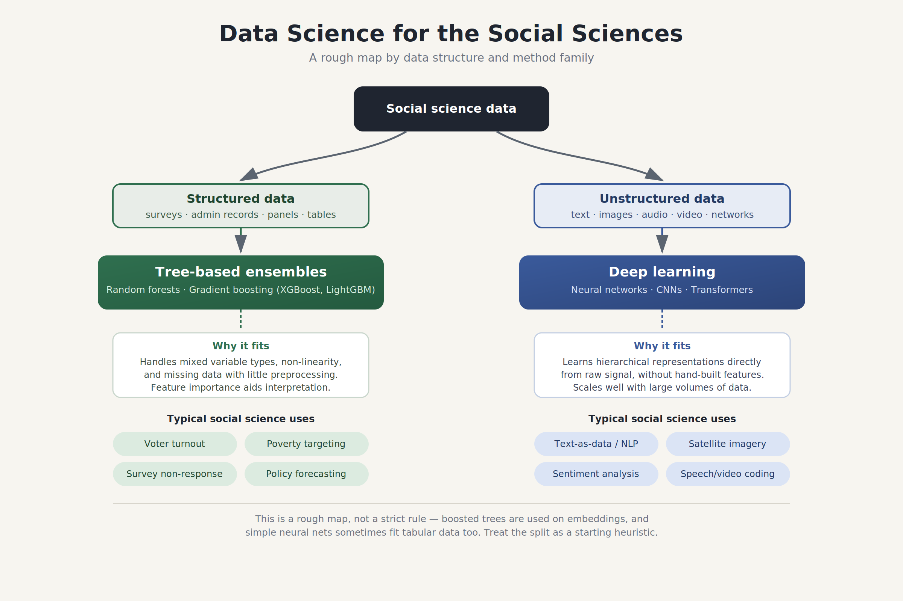
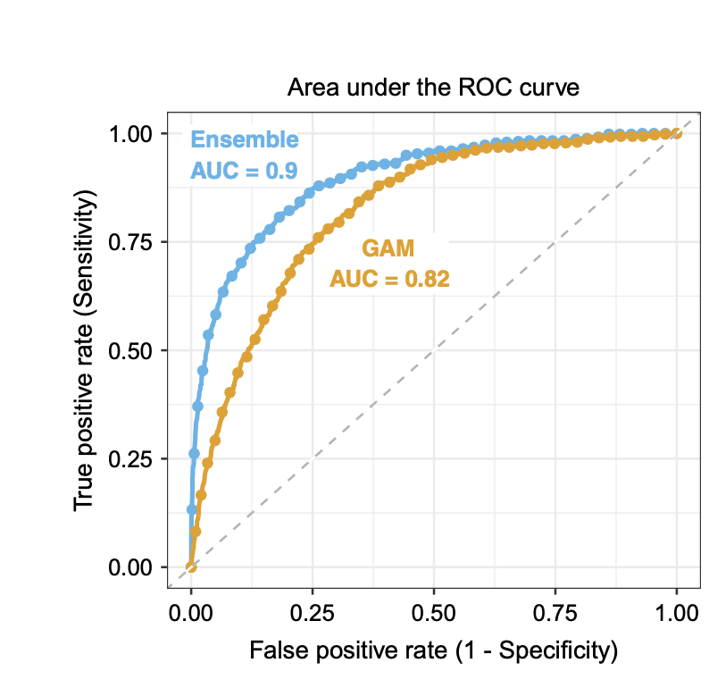

# Defining the Field {background-color="#40666e"}

## Of Experiences, Tasks, and Performance

::: callout-note
### Definition of Machine Learning (ML)

The design of algorithms that learn from data and are capable of improvement as new experiences emerge. Specifically, the algorithm "is said to learn from experience $E$ with respect to some task $T$ and performance measure $P$, if its performance at task $T$, as measured by $P$, improves with experience $E$" [@mitchell1997Machine, 2].
:::

::: notes
Experience is data. Data, tasks, and performance metrics are the holy trilogy of machine learning.
:::

## Key Principles

- Inductive: Algorithms learn from data; little a priori structure (cf. statistical modeling).

- Predictive: Much of ML = predictive modeling $\Rightarrow$ predictive performance is key.

## ML Tasks

1.  Unsupervised machine learning:
    - Does not require labeled outcomes.
2.  Supervised machine learning:
    - Requires labeled outcomes.
    - These could be
      - Classes, i.e., [**classification tasks**]{.alert}.
      - Numerical scores, i.e., [**regression tasks**]{.alert}.

## Data Architectures

- Structured data: Data that is organized in predefined models such as rows and columns.
- Unstructured data: Data that lack a uniform stucture (emails, videos, text, etc.).

## Mapping the Field

{fig-align="center"}

# What Is It Good For? {background-color="#40666e"}

## Prominent Social Science Use Cases for ML

1.  **Automation** of tedious, time-consuming, and error-prone coding tasks (e.g., classifying open-ended text at scale).
2.  **Prediction** of behavior, outcomes, or trends (especially useful in applied policy or institutional settings).
3.  **Measurement** of latent social phenomena from unstructured or complex data.
4.  **Causal discovery and heterogeneity**: using ML to get a better handle on confounders and heterogeneous treatment effects.
5.  **Induction** by discovering novel empirical patterns and regularities in data to help generate new theories [@breiman2001Statistical; @korb2004Introduction].
6.  **Abduction** [@peirce1975Collected] by identifying anomalies, surprises, or puzzles in massive datasets that challenge existing theoretical frameworks and force conceptual revision [@brandt2021Abductive].

## Case Study

- @hare2023Measuring use machine learning to identify swing voters in the American electorate.

- Premise: 70 years of political theory shows swing voting is driven by cross-pressures.

- Problem: cross-pressures manifest as high-order, non-linear interactions $\Rightarrow$ linear regression fails.

## Case Study Cont'd

- Methodology: Supervised Machine Learning Ensemble using 45 baseline variables from the Cooperative Campaign Analysis Project.

- Trees play a major role in the ensemble.

- The ensemble successfully generates a "swing voter propensity score" that accurately predicts out-of-sample behavior, split-ticket voting, and choices in later elections.

## Case Study Cont'd

:::::: columns
:::: {.column width="50%"}
{fig-align="left"}

::: {style="font-size: 75%"}
**Source:** @hare2023Measuring, p. 544.
:::
::::

::: {.column width="50%"}
Key findings:

- High predictive performance.

- Myth of the uninformed swing voter.

- Feature ablation shows the importance of ideological inconsistencies.
:::
::::::

## References
