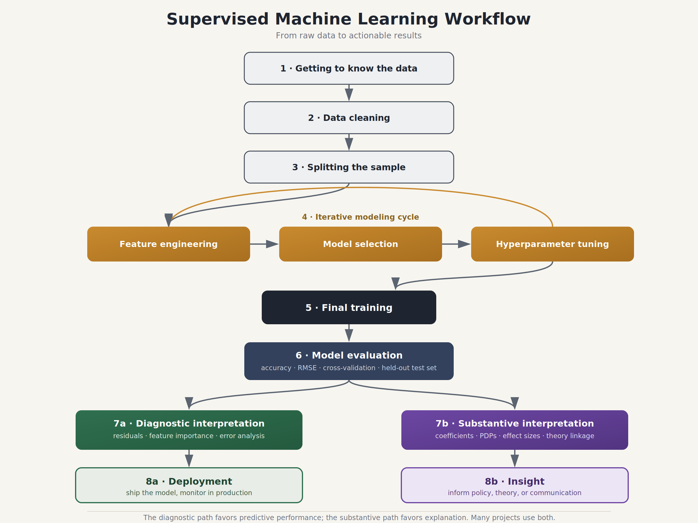

## R Packages for this Lecture

- `GGally` for bivariate analysis and visualization

- `mlbench` for ML benchmark data sets

- `naniar` for missingness

- `skimr` for univariate summaries

- `tidymodels` for ML

- `tidyverse` for data manipulation

# The Generic Supervised Learning Problem {background-color="#40666e"}

## The Learning Goal

::: callout-note
## Model

An algorithm learns the model

$$y_i = f \left( \boldsymbol{x}_i, \boldsymbol{\theta} \right)$$

Here:

- $i$ is an instance (unit)

- $y$ is the predictive target (outcome variable)---there can be more than one

- $f$ is an unknown function

- $\boldsymbol{x}$ is the feature vector (predictor variables)

- $\boldsymbol{\theta}$ contains biases and weights (parameters)
:::

## The Prediction Task

::: callout-note
## Prediction

Once we have learnt the model, we predict:

$$\hat{y}_i = \hat{f} \left( \boldsymbol{x}_i^*, \hat{\boldsymbol{\theta}} \right)$$

Here,

- $\hat{y}$ is the prediction—a score, class, or probability

- $\hat{f}$ is the learnt function

- $\boldsymbol{x}^*$ is a subset of features (see next slide)

- $\hat{\boldsymbol{\theta}}$ are the learnt biases and weights
:::

## The Feature Selection Task

- Supervised ML is not just used for prediction.

- We also want to assess [**feature importance**]{.alert}: how important is a feature for the predictive task.

- One step further is [**feature selection**]{.alert}:

  - Automatically drop irrelevant features so that $\boldsymbol{x}^* \subset \boldsymbol{x}$.
  - Not always done, but can be very useful to guide data collection efforts.

## From Model to Prediction

- The learning in ML entails finding $\hat{f}$, $\hat{\boldsymbol{\theta}}$, and $\boldsymbol{x}^*$.

- The learning space is dictated by the algorithm:

  - Some algorithms are more flexible than others

  - E.g., some allow for automatic interaction detection while others do not

- The learning process can be cast as a statistical **optimization** problem:

  - Within the constraints of the model, we approximate $f$, $\boldsymbol{\theta}$, and select features to minimize loss.

## The Loss Function

- [**Loss**]{.alert} = error = any discrepancy between $y$ and $\hat{y}$.
- The l**oss function** quantifies the totality of prediction error $L = l(\boldsymbol{y}, \hat{\boldsymbol{y}})$ (the boldface means we collect targets and predictions in vectors).
- Different loss functions exist for different tasks.
- However the general principle is always the same:
  - Within the constraints of the algorithm and the feature pool, we seek to **minimize loss**.
  - This is what we mean by optimization

## Performance

::: callout-note
## Metrics

A performance metric maps the quality of predictions after optimization. While there are many performance metrics [@japkowicz2011Evaluating], they all have this form:

$$P = p(\boldsymbol{y}, \hat{\boldsymbol{y}})$$
:::

# The Inductive Dilemma {background-color="#40666e"}

## Resubstitution Error

- Imagine we do the learning and assess the performance on the exact same data.

  - We call this resubstitution.

- Intuitively, this feels like cheating and it is.

- @efron1983Estimating shows that resubstitution results in optimistic performance estimates.

- The lesson: Do not train and evaluate with the same data!

## A Dilemma

- Ideally, one would have two data sets:

  - One for training

  - Another for testing (evaluation)

- Frequently, we only have one data set in our hands, however.

- What to do: Split the data.

## The Split Sample Approach

::::: columns
::: {.column width="50%"}
```{r}
#| echo: false
#| message: false
library(tidyverse)
dummy <- data.frame(x = c(1), y = c(2))
ggplot(dummy) +
  geom_rect(aes(xmin = 0, xmax = 1.5,
                ymin = 0, ymax = 0.5),
            fill = "#386cb0") +
  geom_rect(aes(xmin = 1.55, xmax = 2.35,
                ymin = 0, ymax = 0.5),
            fill = "#fdb462") +
  annotate("text",
           x = 0.75,
           y = 0.25,
           label = "TRAINING \np",
           color = "white",
           size = 15) +
  annotate("text",
           x = 1.95,
           y = 0.25,
           label = "TESTING \n1 - p",
           color = "white",
           size = 15) +
  theme_void()
```
:::

::: {.column width="50%"}
- If necessary randomize the $n$ instances.

- Set aside a fraction of $p$ instances for training $\Rightarrow$ [**training set**]{.alert} has a size of $n_1 = p \cdot n$.

- Set aside a fraction of $1-p$ instances for evaluation $\Rightarrow$ [**test set**]{.alert} has a size of $n_2 = n - n_1$.

- $0.70 \leq p \leq 0.98$, depending on the complexity of the learning task and the amount of data available.
:::
:::::

# The Machine Learning Workflow {background-color="#40666e"}

## Overview

{fig-align="center"}

## Getting to Know the Data

- Because ML is data-driven, we should *always* start by taking a look at our data.

- Things you should look at:

  - Missing values.

  - Univariate descriptive statistics and visualizations that could flag lack a lack of variance or outliers.

  - Bivariate descriptions and visualizations that give insight about relationships and possible multicollinearity among features.

## Data Cleaning

- Gross errors in the data should be corrected—removal of duplicates and structural errors (e.g., mis-matched strings).

- However, beware of **data leakage**:

  - Information from outside the training dataset is inadvertently used to create or tune a machine learning model.

  - E.g., do not do imputation with the mean across all of the data—this contaminates the future training data with information from the future test set.

## Data Splitting

- Instances from the original data are randomly assigned to test and training sets.

- We can do this in a variety of ways:

  - Simple random sampling.

  - Stratified random sampling based on the target or a feature.

- For reproducibility always set a seed.

## Feature Engineering

- **Feature engineering** = the process of using domain knowledge to transform raw data into features that expose the underlying problem to a machine learning algorithm.
- This includes:
  - Feature transformation
  - Feature construction
  - Feature extraction (PCA) and pre-selection

## Model Selection

- Most algorithms do not produce a single but, in fact, many models.

- This is because those algorithms have **hyper-parameters**: parameters that affect the behavior of the algorithm and cannot be estimated.

  - These parameters are the "knobs" data scientists turn to adjust the behavior of the algorithm.

  - Each constellation of hyper-parameters produces a slightly different model.

- Model selection is the process of determining what the best setting of the hyper-parameters is.

## Tuning

- [**Tuning**]{.alert} = the process of generating candidate hyper-parameters.
- There are different procedures for generating these candidates:
  1.  Grid search
  2.  Random search
  3.  Sequential model-based optimization (SMBO)
- We use validation to ascertain the "best" hyper-parameter constellation.

## Final Training

- Once the best model has been selected, we produce the final fit.

- We freeze the optimal hyper-parameter values.

- We then train the model one more time.

## Evaluation

- Only after final training will we go to the test set to assess predictive performance.

- At this stage, we compute performance metrics.

- Those metrics in large part drive whether we continue with the algorithm or go back to the drawing board.

## A Fork in the Road

- We can now proceed in two directions:

  1.  Use the algorithm to automate a task, for instance, to generate target values for completely new data (deployment).

  2.  Use the algorithm for substantive purposes, e.g., generating new insights about a phenomenon.

- In both cases, we may want to engage in both diagnostic and substantive interpretation, but their relative weights change.

- Before deployment it is crucial to assess which predictors influence predictions the most and where the model fails.

- Before claiming new insights, we must scrutinize the substantive effects of predictors using partial dependence plots or other methods.

## The Computational Workflow in `tidymodels`

{fig-align="center"}

# Regression as a Machine {background-color="#40666e"}

## The Regression Model

- We do not typically think of regression as a machine learning algorithm, but it is.

- The target is a numeric score—regression task.

- We have the following model:

  $$y_i = \underbrace{\alpha}_{\text{Bias}} + \sum_{j=1}^P \underbrace{\beta_j}_{\text{Weight}} \cdot x_{ij} + \text{error}$$

## Visualization in 2 ways

::::: columns
::: {.column width="50%"}
### Hyperplane

```{r}
#| echo: false
library(scatterplot3d)

set.seed(1234)
n  <- 50
x1 <- runif(n, min = 2, max = 4)          # feature 1
x2 <- runif(n, min = 1, max = 2)          # feature 2
y  <- 1 + 0.8 * x1 + 1.5 * x2 +           # true surface
      rnorm(n, mean = 0, sd = 0.3)        # noise

mreg_df <- data.frame(x1, x2, y)
LM <- lm(y ~ x1 + x2, data = mreg_df)

s3d <- scatterplot3d(x1, x2, y,
                     pch = 19, type = "p", color = "darkgray",
                     grid = TRUE, box = FALSE,
                     mar = c(2.5, 2.5, 2, 1.5),
                     angle = 55)
s3d$plane3d(LM, draw_polygon = TRUE, draw_lines = TRUE,
            polygon_args = list(col = rgb(.1, .2, .7, .5)))
wh <- resid(LM) > 0
s3d$points3d(x1[wh], x2[wh], y[wh], pch = 20, color = "darkgray")
```
:::

::: {.column width="50%"}
### Feature Space

```{r}
#| echo: false
library(ggrepel)
library(ggthemes)
mreg_df <- mreg_df %>%
  mutate(name = as.character(round(y, digits = 2)))
ggplot(mreg_df, aes(x = x1, y = x2), col = "#31688EFF",
       label = name) +
  geom_point(size = 2.5, col = "#31688EFF") +
  geom_label_repel(aes(label = name),
                  box.padding   = 0.10, 
                  point.padding = 0.15,
                  label.size = 0.05,
                  label.padding = 0.02,
                  segment.color = "#31688EFF",
                  max.overlaps = 15)+
  theme_bw()
```
:::
:::::

## Loss Function

- We use a training set to learn $\alpha, \beta_1, \cdots, \beta_P$.

- A typical loss function is the $L_2$-norm (cf. ordinary least squares):

  $$L = \sum_{i=1}^{n_1} \left(y_i - \underbrace{\left \{ \alpha + \sum_j \beta_j \cdot x_{ij} \right \}}_{\hat{y}_i} \right)^2$$

- We minimize the loss by finding the best possible values of the bias and weights in the training set.

## Performance

- We apply the trained biases and weights and use that to make predictions in the test set.

- Those predictions are compared to the actual target values in the test set.

- Common performance metrics are:

  - RMSE: $P = \sqrt{\sum_{i=1}^{n_2} (y_i - \hat{y}_i)^2}$.

  - R-squared: $R^2 = \text{cor}_{y_i,\hat{y}_i \in \text{test set}}^2$.

# Building Our First Workflow {background-color="#40666e"}

## The Political Economy of Housing Values

- @harrison1978Hedonic present data on median housing values in census tracts in the Boston area.

- They are particularly interested in the effect of pollution on housing values.

- We also add property taxes to our analysis.

- The data can be found in the `mlbench` package.

## Data Screening

::: panel-tabset
### Data

```{r}
#| echo: true
#| message: false
library(mlbench)
library(tidyverse)
data("BostonHousing2")
df <- BostonHousing2 |>
  select(cmedv, nox, tax, tract)

```

### Missing

```{r}
#| echo: true
#| message: false
library(naniar)
gg_miss_var(df, show_pct = FALSE) +
  labs(y = "# Missing") +
  theme_minimal()
```

### Univariate

```{r}
#| echo: true
#| message: false
library(skimr)
skimmed <- skim(df[,1:3])
yank(skimmed, "numeric")
```

### Bivariate 1

```{r}
#| echo: true
#| eval: false
library(GGally)
df_small <- df[,1:3]
p <- ggpairs(df_small,
             lower = list(continuous = "smooth_loess"),
             upper = list(continuous = wrap(ggally_cor, displayGrid = FALSE)))
p + theme_minimal()
```

### Bivariate 2

```{r}
#| echo: false
#| message: false
library(GGally)
df_small <- df[,1:3]
p <- ggpairs(df_small,
             lower = list(continuous = "smooth_loess"),
             upper = list(continuous = wrap(ggally_cor, displayGrid = FALSE)))
p + theme_minimal()
```
:::

## Conclusion from Screening

- Skewness $\Rightarrow$ Box-Cox transformation [@box1964Analysis] or logarithm.

  - High risk of data leakage when estimation involved (Box-Cox).

  - Must be done after the split using the `prep()`and `bake()` logic of `tidymodels`. However, target is the exception.

- Bi-modality due to cases with high property tax rates $\Rightarrow$ add dummy:

  - Suburbs with high accessibility to radial highways—structural property.

  - This can be done before the split because no estimation needs to be done.

## Initial Split

::: panel-tabset
### Data

```{r}
#| echo: true
df_new <- df |>
  mutate(target = log10(cmedv),
         high_tax = ifelse(tax > 600, 1, 0)) |>
  select(tract, target, nox, tax, high_tax)
```

### Split

```{r}
#| echo: true
#| message: false
library(tidymodels)
set.seed(1292)
housing_split <- initial_split(df_new, prop = 0.75)
housing_split
```

### Apply

```{r}
#| echo: true
train_df <- training(housing_split)
test_df <- testing(housing_split)
```
:::

## Feature Engineering

::: panel-tabset
### Goal

On the training data, we do the following:

- Change the role of "tract" to that of an identifier.

- Perform a Box-Cox transformation on "nox" and "tax"

### Syntax

```{r}
#| echo: true
housing_recipe <- recipe(target ~ ., data = train_df) |>
  update_role(tract, new_role = "id") |>
  step_BoxCox(nox, tax)
```

### Result

```{r}
#| message: true
housing_recipe
```
:::

## Model and Workflow

```{r}
#| echo: true
housing_model <- linear_reg() |>
  set_mode("regression") |>
  set_engine("lm")
housing_wf <- workflow() |>
  add_model(housing_model) %>%
  add_recipe(housing_recipe)
```

## Training

::: panel-tabset
### Comment

- There are no hyper-parameters.

- We do not need to tune and can go straight to the final fit.

### Syntax

```{r}
#| echo: true
housing_fit <- fit(housing_wf, train_df)
```

### Results 1

```{r}
#| echo: true
tidy(housing_fit)
```

### Results 2

```{r}
#| echo: true
glance(housing_fit)
```
:::

## Performance

::: panel-tabset
### Prediction

```{r}
#| echo: true
housing_fit |>
  predict(test_df) |>
  bind_cols(test_df)
```

### Metrics

```{r}
#| echo: true
housing_fit |>
  predict(test_df) |>
  bind_cols(test_df) |>
  metrics(truth = target, estimate = .pred)
```
:::

## Exercise

::: callout-tip
## Your Turn

Add two additional features to the model and repeat the workflow.
:::

# The Risks of Machine Learning {background-color="#40666e"}

## Machine Learning Errors

| Error Source | Description | Cause(s) |
|------------------------|------------------------|------------------------|
| Irreducible error | Error that cannot be eliminated | \(1\) missing features; (2) measurement error; and (3) random shocks |
| Bias error | Systematic prediction error | Under-fitting |
| Variance error | Lack of generalizability of the model | Over-fitting—too much flexibility |

## Illustrating Bias and Variance Error

{fig-align="center"}

::: {style="font-size: 75%"}
**Source:** [Seema Singh](https://towardsdatascience.com/understanding-the-bias-variance-tradeoff-165e6942b229)
:::

## The Bias-Variance Trade-off

- Flexibility $\uparrow$, bias error $\downarrow$ but variance error $\uparrow$.

- Flexibility $\downarrow$, variance error $\downarrow$ but bias error $\uparrow$.

## We Need to Consider Both Bias and Variance

- [**Mean squared error**]{.alert}:

  $$\text{MSE} = \text{Bias}^2 + \text{Variance}$$

- We want to minimize MSE.

- Sometimes that means introducing a bit of bias in order to reduce the variance $\Rightarrow$ regularization.

## References
