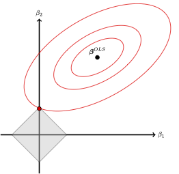
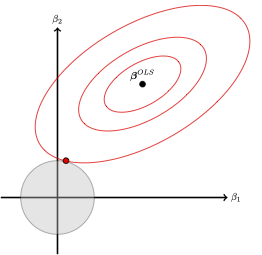
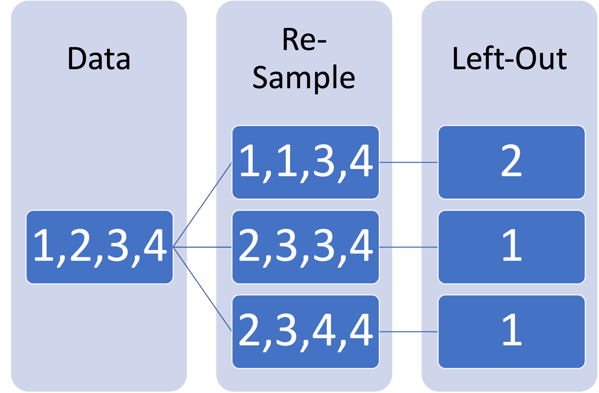

## R Packages for this Lecture

Next to the packages from the last time, we need:

- `future` and `doFuture` for parallel processing during tuning (speeds things up).
- `glmnet` for regularized linear and logistic regression.

# What Is Regularization? {background-color="#40666e"}

## The Basic Idea

- [**Regularization**]{.alert} adds a penalty for over-fitting to the loss function.

- This penalty serves as a constraint on the optimization problem.

- We can also think of this as a shrinkage estimator, with small coefficients being shrunk more than larger coefficients.

- The most important regularization procedures are

  1.  The lasso.

  2.  Tikhonov regularization/ridge regression.

  3.  Elastic nets.

## The Lasso

::::: columns
::: {.column width="60%"}
- [**Lasso**]{.alert} = least absolute shrinkage and selection operator [@tibshirani1996Regression].

- We impose $\sum_{j=1}^P \lvert \beta_j \rvert \leq t$.

- Using Lagrange multipliers, the lasso loss is $L_{\text{lasso}} = L_2 + \lambda \left( \sum_{j=1}^P \lvert \beta_j \rvert - t \right)$.

- Retaining only the terms in $\omega$, the optimization problem is

  $$\min_{\alpha, \boldsymbol{\beta}} \sum_{i=1}^{n_1} \left( \alpha + \boldsymbol{x}_i^\top \boldsymbol{\beta} - y_i \right)^2 + \lambda \lvert \boldsymbol{\beta} \rvert$$

- $\lambda$ is a hyper-parameter.
:::

::: {.column width="40%"}
{fig-align="right"}
:::
:::::

## What the Lasso Does

::: panel-tabset
### 1st Example

```{r}
#| echo: false
#| message: false
library(ggthemes)
ols <- seq(-3, 3, 0.1)
f1 <- ifelse(ols >= 1, ols-1,
             ifelse(ols <= -1, ols+1, 0))
f2 <- ifelse(ols >=2, ols-2,
             ifelse(ols <= -2, ols+2, 0))
f3 <- ols
par(mar=c(5,5,4,2))
plot(ols, f1, type = "l", lwd = 3, col = "#21918c", xlab = expression(beta^OLS),
     ylab = expression(beta^lasso), main = "Orthonormal Features")
points(ols, f2, type = "l", lwd = 3, col = "#fde725")
points(ols, f3, type = "l", lwd = 3, col = "#440154")
legend("topleft",
       legend=c(expression(lambda==0), expression(lambda==1), expression(lambda==2)),
       col=c("#440154", "#21918c", "#fde725"),
       lty = c(1, 1, 1),
       lwd = c(3, 3, 3))
```

### 2nd Example

```{r}
#| echo: false
#| message: false
library(glmnet)
library(MASS)
library(plotmo)
mu <- c(5,5)
sd <- c(2,2)
r <- 0.6
sigma <- matrix(
  c(sd[1]^2,r*sd[1]*sd[2],r*sd[1]*sd[2],sd[2]^2),
  nrow = 2, ncol = 2, byrow = TRUE
)
n <- 100
set.seed(1617)
X <- mvrnorm(n, mu, sigma)
e <- rnorm(n, 0, 2)
y <- -2 + X[,1] + 0.2*X[,2] + e
lasso_fit <- glmnet(X, y, alpha = 1)
plot_glmnet(lasso_fit, lwd = 3, col = c("#21918c","#fde725"),
            main = "Correlated Features")
```
:::

## Variations on a Theme

- We can think of the lasso as a special case of

  $$\min_{\alpha,\boldsymbol{\beta}} \sum_{i=1}^{n_1} \left( \alpha + \boldsymbol{x}_i^\top \boldsymbol{\beta} - y_i \right)^2 + \lambda \lvert \boldsymbol{\beta} \rvert^q$$

- For $q = 1$, this becomes the lasso.

- For $q = 2$, this becomes [**Tikhonov regularization**]{.alert} (a.k.a. ridge regression).

## Tikhonov Regularization

::::: columns
::: {.column width="40%"}
{fig-align="left"}
:::

::: {.column width="50%"}
- We minimize the $L_2$-norm subject to $\sum_{j=1}^P \beta_j^2 \leq t$ [@tikhonov1963Solution].

- Hence,

  $$\min_{\boldsymbol{\alpha, \beta}} \sum_{i=1}^{n_1} \left( \alpha + \boldsymbol{x}_i^\top \boldsymbol{\beta} - y_i \right)^2 + \lambda \sum_{j=1}^P \beta_j^2$$
:::
:::::

## Elastic Nets

- Elastic nets are a mixture of the lasso and Tikhonov regularization [@zou2005Regularization].

- For $\gamma \in [0,1]$, define the penalty

  $$P(\gamma) = \sum_{j=1}^P \left[ \frac{1}{2} (1 - \gamma) \omega_j^2 + \gamma \lvert \omega_j \rvert \right]$$

- Then

  $$\min_{\boldsymbol{\omega}} \sum_{i=1}^{n_1} \left( \beta + \boldsymbol{x}_i^\top \boldsymbol{\omega} - y_i \right)^2 + \lambda P(\gamma)$$

## Elastic Nets Cont'd

- Note this reduces to

  - the lasso for $\gamma = 1$.

  - Tikhonov regularization for $\gamma = 0$.

- Here $\gamma$ is another hyper-parameters.

## Important

- A valid use of regularization requires that features are put on the same scale.

- `tidymodels` offers several ways to accomplish this:

  - `step_normalize()` standardizes the features.

  - `step_range()` scales the minimum and maximum to 0 and 1, respectively.

# How to Select and Validate Hyper-Parameters {background-color="#40666e"}

## A Wealth of Possibilities

- In rare cases—e.g., principal component analysis—hyper-parameters take on a finite number of discrete values $\Rightarrow$ grid search: try each value.

- This is not our case: $\gamma$ and $\lambda$ are both continuous and there are endless combinations.

- The simplest possibility is to do a random search:[^1]

  - Max entropy when there is 1 hyperThe-parameter.

  - Latin hyper-cubes with max entropy when there are multiple hyper-parameters.

[^1]: SMBO will be introduced later in the course.

## Space-Filling and Latin Hyper-cubes

- **Goal:** For a $K$-dimensional parameter space, we must ensure uniform coverage across all dimensions.
  - Standard random sampling leaves empty voids and redundant clusters.
  - Space-filling designs (like Latin Hyper-cubes) force points to spread evenly [@husslage2011Spacefilling; @mckay1979Comparison].
- **Maximum Entropy Designs** (e.g., Kriging / Gaussian Process approach):
  - Model hyperparameter locations as a spatial process where points are correlated.
  - The `variogram_range` parameter controls the spatial decay / effective repulsion scale.
  - **Higher `variogram_range` values** expand the repulsion field, reducing the likelihood of large empty voids in the space.

## Evaluating the Grid

- Now that we have set the grid, how do we evaluate different choices of hyper-parameter values?

- The basic idea is this:

  1.  Set $(\gamma, \lambda)$.

  2.  Train the model with those values.

  3.  Evaluate performance without touching the test data—they come at the very end.

- The problem: resubstitution error [@efron1983Estimating].

- We need to set aside data within the training set to **validate** our choice of hyper-parameters.

## Building Validation Sets

1.  The validation split.
2.  $v$-Fold cross-validation.
3.  Bootstrapping.

## The Validation Split

- Take the $n_1$ training instances.

- Set a probability of $q$ for training use and $1 - q$ for validation use:

  - $q \cdot n_1$ training instances proper—used to estimate $\boldsymbol{\theta}|\boldsymbol{\tau}$, where $\boldsymbol{\tau}$ is a set of hyper-parameter values from the grid.

  - $(1 - q) \cdot n_1$ validation instances—used to assess predictive performance given $\boldsymbol{\tau}$.

- We iterate over the grid and pick as $\boldsymbol{\tau}$ that set of values that maximize performance in the [**validation set**]{.alert}.

## The Validation Split Cont'd

::: panel-tabset
## Data

```{r}
#| echo: true
#| message: false
library(mlbench)
library(tidymodels)
library(tidyverse)
tidymodels_prefer()
data("BostonHousing2")
df_new <- BostonHousing2 |>
  mutate(target = log10(cmedv),
         high_tax = ifelse(tax > 600, 1, 0)) |>
  select(tract, target, nox, tax, high_tax)
set.seed(1292)
housing_split <- initial_split(df_new, prop = 0.75)
train_df <- training(housing_split)
```

## Validation

```{r}
#| echo: true
# We set q = 0.75
set.seed(2158)
validation_set <- validation_split(train_df, prop = 3/4)
validation_set
```
:::

## The Validation Split Cont'd

- Advantage: Only have to train once per combination of hyper-parameters.

- Disadvantages:

  1.  We lose training data: $q \cdot n_1 < n_1$.

  2.  We may end up with an atypical validation set.

  3.  We obtain only one performance value per combination.

- In large samples, the first two problems lose relevance and the computational advantage often outweighs the third disadvantage.

- In medium-sized data, the disadvantages loom larger [@molinaro2005Prediction].

- But can we do better?

## $v$-Fold Cross-Validation

::::: columns
::: {.column width="50%"}
```{r}
#| message: false
library(tidyverse)
dummy <- data.frame(x = c(1), y = c(2))
ggplot(dummy) +
  geom_rect(aes(xmin = 0, xmax = 0.75,
                ymin = 0, ymax = 0.25),
            fill = "#386cb0") +
  geom_rect(aes(xmin = 0.8, xmax = 1.55,
                ymin = 0, ymax = 0.25), fill = "#386cb0") +
  geom_rect(aes(xmin = 1.6, xmax = 2.35,
                ymin = 0, ymax = 0.25),
            fill = "#fdb462") +
  geom_rect(aes(xmin = 0, xmax = 0.75,
                ymin = -0.3, ymax = -0.05),
            fill = "#386cb0") +
  geom_rect(aes(xmin = 0.8, xmax = 1.55,
                ymin = -0.3, ymax = -0.05),
            fill = "#fdb462") +
  geom_rect(aes(xmin = 1.6, xmax = 2.35,
                ymin = -0.3, ymax = -0.05),
            fill = "#386cb0") +
  geom_rect(aes(xmin = 0, xmax = 0.75,
                ymin = -0.6, ymax = -0.35),
            fill = "#fdb462") +
  geom_rect(aes(xmin = 0.8, xmax = 1.55,
                ymin = -0.6, ymax = -0.35),
            fill = "#386cb0") +
  geom_rect(aes(xmin = 1.6, xmax = 2.35,
                ymin = -0.6, ymax = -0.35),
            fill = "#386cb0") +
  annotate("text",
           x = 0.375,
           y = 0.125,
           label = "TRAIN",
           color = "white",
           size = 10) +
   annotate("text",
           x = 1.175,
           y = 0.125,
           label = "TRAIN",
           color = "white",
           size = 10) +
  annotate("text",
           x = 1.975,
           y = 0.125,
           label = "VALIDATE",
           color = "white",
           size = 10) +
  annotate("text",
           x = 0.375,
           y = -0.175,
           label = "TRAIN",
           color = "white",
           size = 10) +
  annotate("text",
           x = 1.175,
           y = -0.175,
           label = "VALIDATE",
           color = "white",
           size = 10) +
  annotate("text",
           x = 1.975,
           y = -0.175,
           label = "TRAIN",
           color = "white",
           size = 10) +
  annotate("text",
           x = 0.375,
           y = -0.475,
           label = "VALIDATE",
           color = "white",
           size = 10) +
  annotate("text",
           x = 1.175,
           y = -0.475,
           label = "TRAIN",
           color = "white",
           size = 10) +
  annotate("text",
           x = 1.975,
           y = -0.475,
           label = "TRAIN",
           color = "white",
           size = 10) +
  theme_void()
```
:::

::: {.column width="50%"}
[$v$-Fold Cross-Validation]{.alert} steps:

- Randomly assign instances to $k$ folds (typically, $v = 10$).

- Each fold is held out once for validation purposes $\Rightarrow$ $v$ performance estimates per $\boldsymbol{\tau}$.

- Each fold is used $v-1$ times for training purposes $\Rightarrow$ no loss of training data.
:::
:::::

## Variations on a Theme

- The higher we set $k$, the more data will be used for training at any given time.

- An extreme case is [**leave out one CV**]{.alert} (LOOCV), where $k = n_1 - 1$.

- In each run, bias is reduced but variance is increased.

- Another way to reduce bias is to **repeatedly** assign instance to the folds, each time using a different seed.

- [**Monte Carlo CV**]{.alert} selects the folds randomly each time, which may cause folds to contain overlapping instances [@xu2001Monte].

## $v$-Fold Cross-Validation in `tidymodels`

::: panel-tabset
### Vanilla

```{r}
#| echo: true
set.seed(1923)
vanilla_folds <- vfold_cv(train_df, v = 10)
vanilla_folds
```

### Repeated

```{r}
#| echo: true
set.seed(1923)
repeated_folds <- vfold_cv(train_df, v = 10, repeats = 5)
repeated_folds
```

### LOOCV

```{r}
#| echo: true
set.seed(1923)
loocv_folds <- loo_cv(train_df)
loocv_folds
```

### Monte Carlo

```{r}
#| echo: true
set.seed(1923)
mc_folds <- mc_cv(train_df, prop = 9/10, times = 20)
mc_folds
```
:::

## Bootstrapping

::::: columns
::: {.column width="50%"}
{fig-align="center"}
:::

::: {.column width="50%"}
- The [**bootstrap**]{.alert} consists of repeatedly sampling $n_1$ instances with replacement [@efron1979Bootstrap].

- Sampled instances are used for training.

- Non-sampled instances are used for validation.
:::
:::::

## Bootstrapping Cont'd

```{r}
#| echo: true
set.seed(1923)
booted <- bootstraps(train_df, times = 100)
booted
```

# Doing Regularization in R {background-color="#40666e"}

## Data Split

```{r}
#| echo: true
#| message: false
library(mlbench)
library(tidymodels)
library(tidyverse)
tidymodels_prefer()
data("BostonHousing2")
df_new <- BostonHousing2 |>
  mutate(target = log10(cmedv),
         high_tax = ifelse(tax > 600, 1, 0)) |>
  select(tract, target, nox, tax, high_tax)
set.seed(1292)
housing_split <- initial_split(df_new, prop = 0.75)
train_df <- training(housing_split)
test_df <- testing(housing_split)
```

## Workflow

::: panel-tabset
## Recipe

```{r}
#| echo: true
# The order matters for this recipe
housing_recipe <- recipe(target ~ ., data = train_df) |>
  update_role(tract, new_role = "id") |>
  step_BoxCox(nox, tax) |>
  step_range(all_numeric_predictors())
```

## Model

```{r}
#| echo: true
# Penalty = lambda; mixture = gamma
housing_model <- linear_reg(
  penalty = tune(),
  mixture = tune()
) |>
  set_mode("regression") |>
  set_engine("glmnet")

```

## Workflow

```{r}
#| echo: true
housing_wf <- workflow() |>
  add_recipe(housing_recipe) |>
  add_model(housing_model)
```
:::

## Tuning the Model

::: panel-tabset
## Grid

```{r}
#| echo: true
# Extract hyperparameter set and update space bounds if needed
glmnet_param <- extract_parameter_set_dials(housing_model)

# Create a space-filling design with 50 configurations
# For serious tuning, you'd probably increase this
set.seed(1561)
elastic_grid <- grid_space_filling(
  glmnet_param, 
  size = 50,
  type = "latin_hypercube"
)

print(elastic_grid, n = 6)
```

## CV

```{r}
#| echo: true
# 10-fold CV with 5 repeats
set.seed(1923)
elastic_cv <- vfold_cv(train_df, v = 10, repeats = 5)
```

## Iterating

```{r}
#| echo: true
library(future)
library(doFuture)
# Setting evaluation metrics for validation
elastic_metrics <- metric_set(rsq)

# Setup modern, cross-platform parallel execution using all available cores
plan(multisession, workers = parallelly::availableCores())

# Register backend for foreach compatibility in tidymodels
registerDoFuture()

elastic_tune <- housing_wf |>
  tune_grid(
    resamples = elastic_cv,
    grid = elastic_grid,
    metrics = elastic_metrics,
    control = control_grid(save_pred = TRUE, verbose = FALSE)
  )

# Explicitly shut down background workers
plan(sequential)
```

## Plot 1

```{r}
#| echo: true
#| eval: false
# Plotting syntax: Mean R2 across folds by constellation
autoplot(elastic_tune) +
  theme_light() +
  labs(
    title = "Hyperparameter Tuning for Elastic Net",
    subtitle = "Space-Filling (Latin Hypercube) Design Results"
  )
```

## Plot 2

```{r}
autoplot(elastic_tune) +
  theme_light() +
  labs(
    title = "Hyperparameter Tuning for Elastic Net",
    subtitle = "Space-Filling (Latin Hypercube) Design Results"
  )
```

## Best

```{r}
#| echo: true
# Extract best hyperparameter set
elastic_best <- select_best(elastic_tune, metric = "rsq") # Specify your target metric
elastic_best
```
:::

## Final Fit

::: panel-tabset
## Syntax

```{r}
#| echo: true
housing_updated <- finalize_model(housing_model,
                                  elastic_best)
workflow_new <- housing_wf |>
  update_model(housing_updated)
new_fit <- workflow_new |>
  fit(data = train_df)
tidy_housing <- new_fit |>
  extract_fit_parsnip() |>
  tidy()
```

## Results

```{r}
#| echo: true
tidy_housing
```
:::

## Performance

::: panel-tabset
## Syntax

```{r}
#| echo: true
elastic_testfit <- new_fit |>
  predict(test_df) |>
  bind_cols(test_df) |>
  metrics(truth = target, estimate = .pred)
```

## Results

```{r}
#| echo: true
elastic_testfit
```
:::

## Exercise

::: callout-tip
## Your Turn

Repeat the flow for a model containing all features, excepting "medv", "town", "lon", and "lat".
:::

## References
