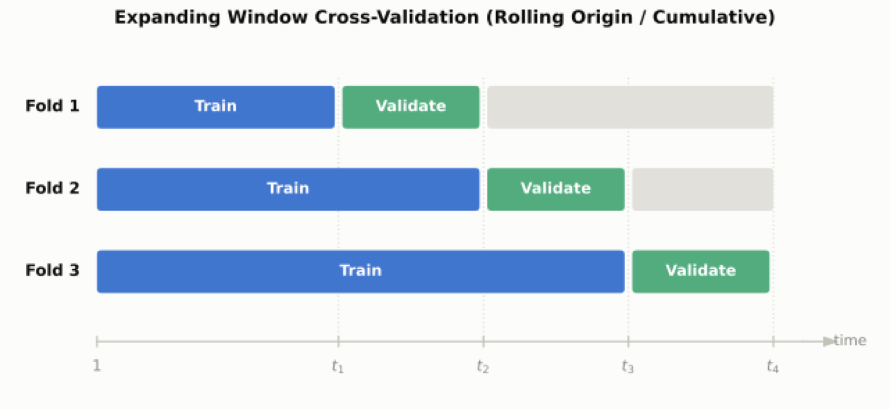
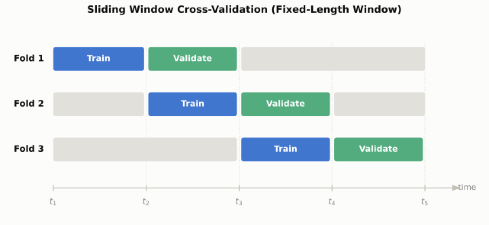

# Time Series {background-color="#40666e"}

## Time Series Are Different

- So far, we have discussed i.i.d. data—independent and identically distributed.

- Time series are different:

  - Chronological dependence is a key feature of these data.

  - Temporal order cannot be ignore without introducing severe data leakage [@hewamalage2023Forecast].

- These considerations affect data splitting as well as modeling,

## Data Splitting

- Training sets cannot be randomly selected—they must preserve chronology.

- Hence, training data reflect the past and test data the future.

- In `tidymodels`, we use `initial_time_split()`.

## Cross-Validation

- Re-sampling for validation must also be handled differently.

- There are two dominant frameworks:

  1.  **Expanding window** (a.k.a. rolling CV or cumulative CV)---best when historical patterns over long horizons build stability.

  2.  **Sliding window** (a.k.a. rolling window)---best when recent data matters more than distant past (non-stationary environments).

## Cross-Validation Cont'd

::::: columns
::: {.column width="50%"}
{fig-align="center"}
:::

::: {.column width="50%"}
{fig-align="center"}
:::
:::::

## Cross-Validation Cont'd

::: panel-tabset
## Expanding

```{r}
#| echo: true
#| eval: false
time_resamples <- rolling_origin(
  train_data,
  initial    = 12,   # Initial training set size (e.g., 12 periods/months)
  assess     = 3,    # Assessment/validation window size
  skip       = 1,    # How many steps to skip between folds
  cumulative = TRUE  # TRUE = Expanding window; FALSE = Fixed-length sliding window
)
```

## Sliding

```{r}
#| echo: true
#| eval: false
time_resamples <- sliding_period(
  train_data,
  index      = date_column, # Name of your date/datetime column
  period     = "month",     # Split unit: "day", "week", "month", "year", etc.
  lookback   = 11,          # Lookback window (e.g., 11 months + current = 12)
  assess_stop = 3,          # Assessment window length
  step       = 1,           # Move forward by 1 month per fold
  complete   = TRUE
)
```
:::

## Algorithms

- Feature engineered ML:

  - Tree ensembles do not inherently know sequence; we provide it by engineering lag variables, rolling aggregations, and time components,

- Classical time series econometrics:

  - ARIMA, AutoARIMA, and exponential smoothing.

- Sequence-first neural architectures:

  - RNs and LSTMs.

# Repeated Cross-Sections and Panel Data {background-color="#40666e"}

## What Is Different

- We have two dimensions of variation:

  1.  Cross-sections that may display clustering.

  2.  Time within entities, with autocorrelation over time in the same entity.

- How we split panel data, fundamentally changes the model's learned structure [@sweet2023CrossValidation].

## Re-Sampling Options

| Approach | Mechanism | What It Tests | Implementation |
|----|----|----|----|
| Group/Unit $v$-fold | Splits by identity ID---all time periods for $i$ stay in the same fold. | Generalization to unseen entities. | `group_vfold_cv(data, group = entity_id)` |
| Temporal panel split | Cut at time $t_1$ across all entities | Generalization to future time points. | `initial_time_split()` or `sliding_period()` |
| Block 2D split | Hold out both unseen entities and future time points | Generalization to unseen entities in the future | Custom grouping on ID + date cutoffs |

## Algorithms

- Classical algorithms may require feature engineering:

  - Demeaning

  - Entity-level historical averages (Mundlak)

- Some interesting new work on double machine learning for panels [@clarke2026Double].

# Hierarchical Data {background-color="#40666e"}

## Re-Sampling

- Cluster-level splits:

  - Hold out entire higher-level units.

  - Generalizability to unseen clusters.

- Stratified within-group splits:

  - Samples individuals from within every group—all clusters are present in test and training sets.

  - Generalizability to unseen cases within known groups.

## Algorithms

- Mixed effects random forests (MERFs) [@hajjem2014Mixedeffects] or binary mixed models (BiMMs) [@speiser2019BiMM]:

  - $y_{ij} = f(\boldsymbol{x}_{ij}, \boldsymbol{\theta}) + \boldsymbol{z}_{ij}^\top \boldsymbol{\beta}_j + \text{error}$

  - First part is non-parametric; second part is linear.

- Mundlak-trees:

  - Tree-based learners with individual features, means, cluster encodings.

- Tree-boosting with random effects [@sigrist2022Gaussian]:

  - Combines mixed effects with gradient boosted decision trees.

## References
