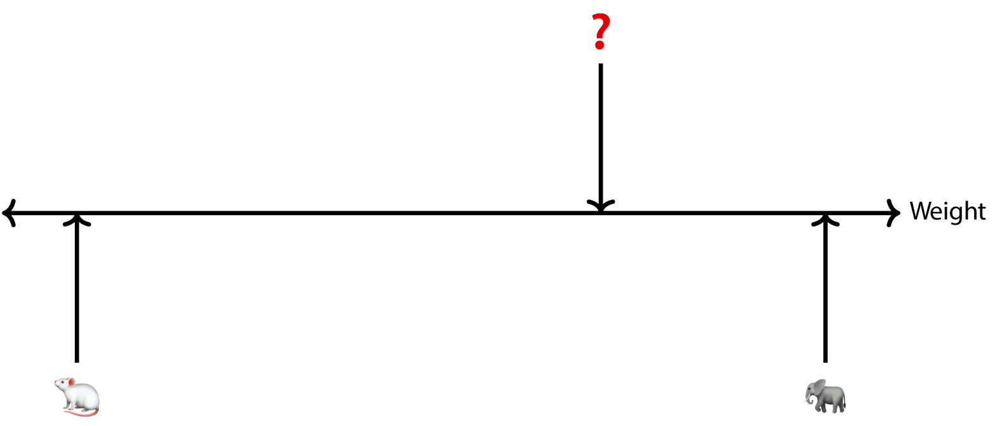
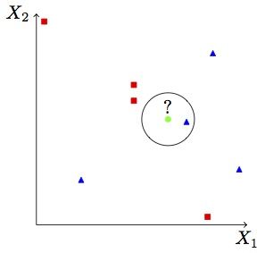
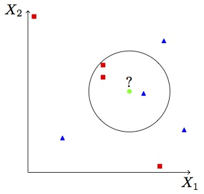
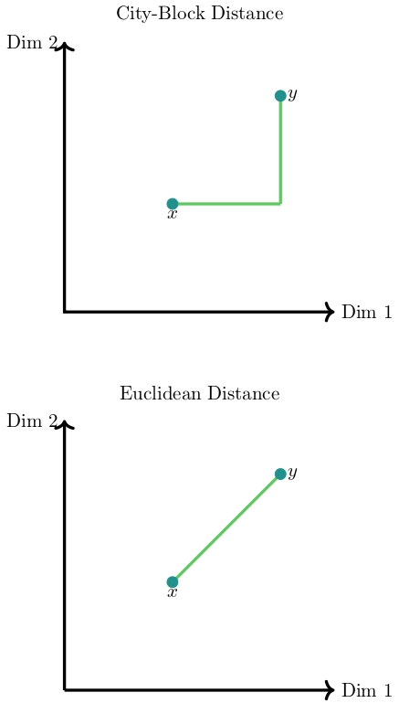

## R Packages for this Lecture

Aside from the packages installed in previous lectures, we need:

- `kknn`for the nearest neighbor algorithm
- `rio` for data import

# The Big Picture {background-color="#40666e"}

## Look! An Elephant

::::: columns
::: {.column width="40%"}
{fig-align="left"}
:::

::: {.column width="60%"}
- The sole predictive feature is the animal's weight.There are two **discrete** labels---elephant and mouse $\Rightarrow$ classification task.

- There is a [**query**]{.alert}, marked by the question mark. We know the query's weight but not its class.

- We could use the predictive feature and ask: In terms of weight, does the query more resemble the elephant or the mouse?

- The prediction would then be "elephant."
:::
:::::

## The General Idea of Nearest Neighbors

- Find the training instance that is most similar to the query; this is the [**nearest neighbor**]{.alert}.
- Assign the training label to the query.
- More generally, we can find $k = 1, 2, \cdots$ nearest neighbors.
- A vote among them determines the prediction.

## The $k$ in $k$-Nearest Neighbors

::::: columns
::: {.column width="50%"}
{fig-align="center"}
:::

::: {.column width="50%"}
{fig-align="center"}
:::
:::::

## Lazy Learning

- The kNN algorithm is a so-called [**lazy learner**]{.alert}.

- Lazy learners do not actually generate a model; they simply return a set of labels.

- That makes them quite appealing for such tasks as imputation.

- However, interpretation suffers.

## The Road Ahead

- Defining what is near(est).

- Performance in classification.

- Using the algorithm for classification.

- Using the algorithm for regression.

# Distance {background-color="#40666e"}

## Establishing Proximity

- Proximity is the converse of distance.

- Assessing distance in one dimension is simple enough.

- But hat do we do when there are many predictive features that all affect distance?

- This is where distance metrics come into play.

## Distance for Numeric Features

::::: columns
::: {.column width="60%"}
- [**Minkowski distance metric**]{.alert}:

  $$d(x,y) = \left( \sum_{j=1}^P \lvert x_j - y_j \rvert^q \right)^{\frac{1}{q}}$$ where $q$ is a power set by the researcher.

- Examples include:

  - **City-Block** (Manhattan) distance: $q = 1$.
  - **Euclidean** distance: $q = 2$.
  - **Chebyshev** distance: $q \rightarrow \infty$, which is tantamount to taking the largest distance.
:::

::: {.column width="40%"}
{fig-align="right" width="350"}
:::
:::::

## Important

- The Minkowski metric is sensitive to scale differences in predictive features.

- Always ensure that the features are on the same scale, using

  - Normalization to 0-1 scales

  - Standardization

## Distance for Qualitative and Mixed Features

- For nominal data, we can use hamming and simple matching distances, and many more [@alamuri2014Survey]; @boriah2008Similarity\].

- For mixtures of nominal, ordinal, and numeric features see @gower1971General, @podani1999Extending, and @wilson1997Improved.

- **Important:** support for these alternatives is limited in `tidymodels`.

# Performance in Classification—Take 1 {background-color="#40666e"}

## A Simple Classification Problem

- Imagine we divide political regimes into democracies and non-democracies.

- Thus, we have $M = 2$ classes.

- We re-label the classes as

  - Event = democracy

  - Non-event = non-democracy

- Our performance metrics so far have been for numeric scores. How do we assess performance for classifiers?

## The Confusion Matrix

::::: columns
::: {.column width="50%"}
|               | **Observed** |           |
|---------------|--------------|-----------|
| **Predicted** | Event        | Non-Event |
| Event         | **A**        | B         |
| Non-Event     | C            | **D**     |
:::

::: {.column width="50%"}
- A = Number of true positives.

- B = Number of false positives.

- C = Number of false negatives.

- D = Number of true negatives.
:::
:::::

## Different Performance Metrics

::::: columns
::: {.column width="60%"}
- $\text{Accuracy} = \frac{A + D}{n_2}$.

- $\text{Sensitivity} = \frac{A}{A + C} = \text{Recall}$.

- $\text{Specificity} = \frac{D}{B + D}$.

- $\text{Precision} = \frac{A}{A + B}$.

- $J = \text{Sensitivity} + \text{Specificity} - 1$ [@youden1950Index].

- $\text{Balanced Accuracy} = 0.5 \cdot (\text{Sensitivity} + \text{Specificity})$.

- $F1 = 2 \cdot \frac{\text{Precision} \cdot \text{Recall}}{\text{Precision} + \text{Recall}}$.
:::

::: {.column width="40%"}
|               | **Observed** |           |
|---------------|--------------|-----------|
| **Predicted** | Event        | Non-Event |
| Event         | A            | B         |
| Non-Event     | C            | D         |
:::
:::::

## Accuracy Baselines

- No information rate (NIR): How well can we predict from the marginal label distribution?

- @cohen1960Coefficient $\kappa$: How well can we predict by chance?

  - $p_c = \frac{1}{n^2} \cdot \left[ (A + B) \cdot (A + C) + (B + D) \cdot (C + D) \right]$.

  - $\kappa = \frac{\text{Accuracy} - p_c}{1 - p_c}$.

  - As per @landis1977Measurement, substantial to perfect agreement requires $\kappa \geq 0.6$.

# Nearest Neighbor Classification {background-color="#40666e"}

## Predicting Whether a Country Is a Democracy
::: panel-tabset
### Data

-   The 2022 *Economist Intelligence Unit*'s democracy index.

-   Labels: Democracy versus other.

-   Predictive features:

    -   Country rank on political stability and the absence of violence.

    -   Country rank on government effectiveness.

    -   Country rank on the rule of law.

### Labels

```{r}
#| echo: true
#| message: false
library(rio)
library(tidyverse)
world22_df <- import("data/world22.xlsx")
work_df <- world22_df |>
  mutate(DEMO = ifelse(REGIME=="Flawed Democracy"|
                         REGIME=="Full Democracy", 1, 2),
         DEMO = factor(DEMO,
                       labels = c("Democracy", "Other"))) |>
  select(DEMO, STABILITY, GOVEFF, RULEOFLAW) |>
  na.omit()
table(work_df$DEMO)
```
:::


## Initial Workflow

::: panel-tabset
### Split Sample

```{r}
#| echo: true
#| message: false
library(tidymodels)
tidymodels_prefer()
set.seed(10)
rsplit <- initial_split(work_df,
                        prop = 0.75,
                        strata = DEMO)
train_df <- training(rsplit)
test_df <- testing(rsplit)
```

### Recipe

```{r}
#| echo: true
# Standardization to ensure same scale of features
knn_rec <- recipe(DEMO ~ ., data = train_df) |>
  step_normalize(all_numeric_predictors())
```

### Model

```{r}
#| echo: true
# Number of neighbors is set as a tuning parameter.
# No other parameters are.
knn_spec <- nearest_neighbor(
  neighbors = tune(),
  weight_func = "optimal",
  dist_power = 2) |>
  set_mode("classification") |>
  set_engine("kknn")

```

### Flow

```{r}
#| echo: true
init_flow <- workflow() |>
  add_recipe(knn_rec) |>
  add_model(knn_spec)
```
:::

## Tuning

::: panel-tabset
### Re-Sampling

```{r}
#| echo: true
set.seed(20)
cv_folds <- vfold_cv(train_df,
                     v = 10,
                     repeats = 5)
```

### Grid

```{r}
#| echo: true
# We set an odd number of neighbors to avoid ties in voting.
# Note: this is a grid search, not a random search
knn_grid <- tibble(neighbors = seq(1, 51, 2)) 
```

### Metrics

```{r}
#| echo: true
knn_perf <- metric_set(accuracy, kap)
```

### Run

```{r}
#| echo: true
#| eval: false
# Since the task is simple, I chose not to do parallelization
knn_tune <- init_flow |>
  tune_grid(cv_folds, grid = knn_grid, metrics = knn_perf)
autoplot(knn_tune) +
  theme_light() +
  labs(title='Hyperparameter Tuning for kNN')
```

### Plot

```{r}
knn_tune <- init_flow |>
  tune_grid(cv_folds, grid = knn_grid, metrics = knn_perf)
autoplot(knn_tune) +
  theme_light() +
  labs(title='Hyperparameter Tuning for kNN')
```

### Details

```{r}
#| echo: true
collect_metrics(knn_tune, summarize = TRUE)
```

### Optimal

```{r}
#| echo: true
knn_opti <- select_best(knn_tune)
knn_opti
```
:::

## Final Workflow

::: panel-tabset
### Optimal Fit

```{r}
knn_updated <- finalize_model(knn_spec,
                              knn_opti)
final_flow <- init_flow |>
  update_model(knn_updated)
final_fit <- final_flow |>
  fit(data = train_df)
```

### Evaluation

```{r}
knn_test_metrics <- final_fit |>
  predict(test_df) |>
  bind_cols(test_df) |>
  metrics(truth = DEMO, estimate = .pred_class)
knn_test_metrics
```

### Confusion Matrix

```{r}
knn_test <- final_fit |>
  predict(test_df) |>
  bind_cols(test_df)
knn_confused <- knn_test |>
  conf_mat(truth = DEMO, estimate = .pred_class)
knn_confused
```

### Statistics

```{r}
summary(knn_confused)
```
:::

## Exercise

::: callout-tip
## Your Turn

Repeat the analysis, this time not only tuning the number of neighbors but also the Minkowski metric. *Hint:* For the tuning grid, it will be helpful to use the `crossing` function.
:::


# Nearest Neighbor Regression {background-color="#40666e"}

## A Simple Algorithm

-   Let $y$ be numeric.

-   For each query $i$, we select a set of $k$ neighbors, ${\cal N}_i$.

-   Our prediction is

    $$
    \hat{y}_i = \frac{1}{k} \sum_{j \in {\cal N}_i} y_{j(i)}
    $$

-   Since we average instead of vote, $k$ can be any integer.

## But Wait ... Why Not Weight?

-   Why should we give equal weight to all neighbors if some are more alike to the query than others?

-   Let us consider all training instances and regulate their importance through a set of weights such that

$$
\hat{y}_i = \frac{1}{n_1} \sum_{j=1}^{n_1} q_j y_j
$$ {#eq-knnreg}

-   The weights, $q_j$, are constructed in such a way that they decrease as a function of $d(i,j)$.

-   We can use various kernels for this purpose.

## The Principle of Weighting

::: columns
::: {.column width="50%"}
```{r}
#| echo: false
d <- runif(1000, min = -1, max = 1)
f <- 1/abs(d)
plot_df <- cbind.data.frame(d,f)
ggplot(plot_df, aes(x = d, y = f)) +
  geom_line(linewidth = 1.5, col = "#386cb0") +
  labs(x = "d", y = "weight",
       title = "Inversion Kernel") +
  theme_bw()
```
:::

::: {.column width="50%"}
-   The kernel is centered about 0 and gives all of the weight to training units that are perfect copies of the query,

-   The weight rapidly decreases as $d(i,j)$ increases.

-   This means that the prediction is a function almost exclusively of those training units that are very close to the query.
:::
:::

## A Plethora of Kernels

```{r}
#| echo: false 
d <- runif(1000, min = -1, max = 1)
f1 <- 1 - abs(d)
f2 <- (3/4)*(1 - d^2)
f3 <- (15/16)*(1 - d^2)^2
f4 <- (35/32)*(1 - d^2)^3
f5 <- (pi/4)*cos(0.5*pi*d)
f6 <- (1/sqrt(2*pi))*exp(-.5*d^2)
type <- c(rep("Triangular", 1000), rep("Epanechnikov", 1000),
            rep("Quartic", 1000), rep("Triweight", 1000),
            rep("Cosine", 1000), rep("Gaussian", 1000))
plot_df <- cbind.data.frame(type = type,
                            d = rep(d,6),
                            f = c(f1,f2,f3,f4,f5,f6))
ggplot(plot_df, aes(x = d, y = f)) +
  geom_line(linewidth = 1.5, col = "#386cb0") +
  facet_wrap(~ type) +
  labs(x = "d", y = "weight") +
  theme_bw()
```

**Note:** We generally make the kernel a tuning parameter.

## And Some More

-   The rectangular kernel means that we do not weight at all.

-   @samworth2012Optimal proposes an optimal kernel where the number of neighbors is set to

    $$
    k \cdot \left( \frac{2 \cdot (P + 4)}{P + 2} \right)^{\frac{P}{P + 4}}
    $$ where $k$ is the number of neighbors used under a rectangular kernel.

## Setting Up kNN Regression in `tidymodels`

::: panel-tabset
### Data

-   We use the same predictive features as before.

-   However, this time we predict the numeric democracy index.

### Split

```{r}
#| echo: true
work_df <- tibble(world22_df) |>
  column_to_rownames(var = "COUNTRY") |>
  select(DEMINDX22, STABILITY, GOVEFF, RULEOFLAW) |>
  na.omit()
set.seed(1561)
demo_split <- initial_split(work_df, prop = 0.75, strata = DEMINDX22)
demo_train <- training(demo_split)
demo_test <- testing(demo_split)
```

### Recipe

```{r}
#| echo: true
demo_recipe <- recipe(DEMINDX22 ~ ., data = demo_train) |>
  step_normalize(all_numeric_predictors())
```

### Model

```{r}
#| echo: true
demo_spec <- nearest_neighbor(neighbors = tune(),
                              weight_func = tune(),
                              dist_power = tune()) |>
  set_mode("regression") |>
  set_engine("kknn")
```


### Flow

```{r}
#| echo: true
demo_flow <- workflow() |>
  add_model(demo_spec) |>
  add_recipe(demo_recipe)
```
:::

## Tuning the kNN Regression Model

::: panel-tabset
### Re-Sampling

```{r}
#| echo: true
set.seed(1891)
cv_folds <- vfold_cv(demo_train, v = 10, repeats = 5)
```

### Grid

```{r}
#| echo: true
demo_grid <- crossing(
  neighbors = 1:75,
  weight_func = c("biweight", "cos", "epanechnikov", "gaussian",
                  "inv", "optimal", "rectangula", "triweight"),
  dist_power = 1:2
)
```

### Run

```{r}
#| echo: true
#| eval: false
library(future)
library(doFuture)
demo_metrics <- metric_set(rsq)
plan(multisession, workers = parallelly::availableCores())
registerDoFuture()
knn_tune <- demo_flow |>
  tune_grid(cv_folds, grid = demo_grid, metrics = demo_metrics)
plan(sequential)
autoplot(knn_tune) +
  theme_light() +
  labs(title='Hyperparameter Tuning for kNN')
```

### Results

```{r}
#| echo: false
library(future)
library(doFuture)
demo_metrics <- metric_set(rsq)
plan(multisession, workers = parallelly::availableCores())
registerDoFuture()
knn_tune <- demo_flow |>
  tune_grid(cv_folds, grid = demo_grid, metrics = demo_metrics)
plan(sequential)
autoplot(knn_tune) +
  theme_light() +
  labs(title='Hyperparameter Tuning for kNN')
```
:::

## Finalizing the Fit and Making Predictions

::: panel-tabset
### Fit

```{r}
#| echo: true
knn_updated <- finalize_model(demo_spec,
                              select_best(knn_tune))
workflow_new <- demo_flow |>
  update_model(knn_updated)
new_fit <- workflow_new |>
  fit(data = demo_train)
```

### Evaluation

```{r}
#| echo: true
knn_test_metrics <- new_fit |>
  predict(demo_test) |>
  bind_cols(demo_test) |>
  metrics(truth = DEMINDX22, estimate = .pred)
knn_test_metrics
```
:::

## References
