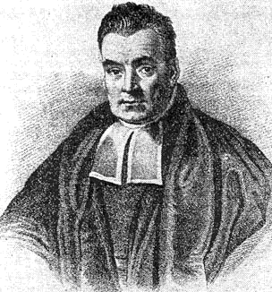
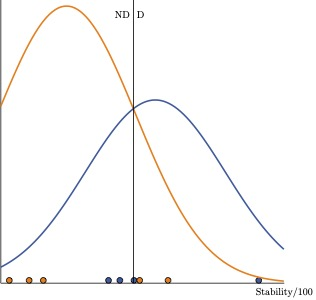
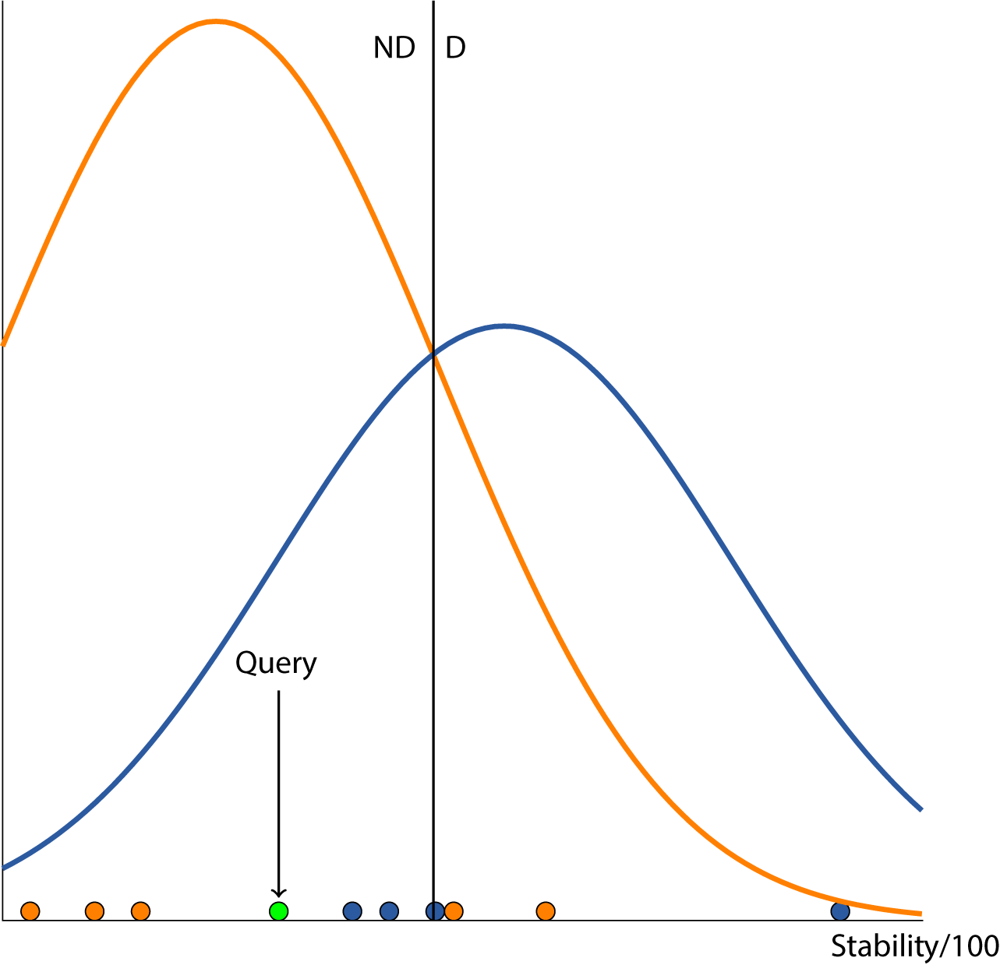
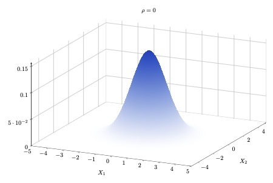
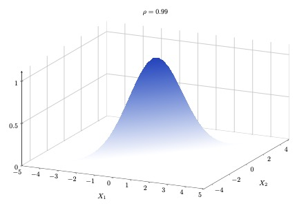
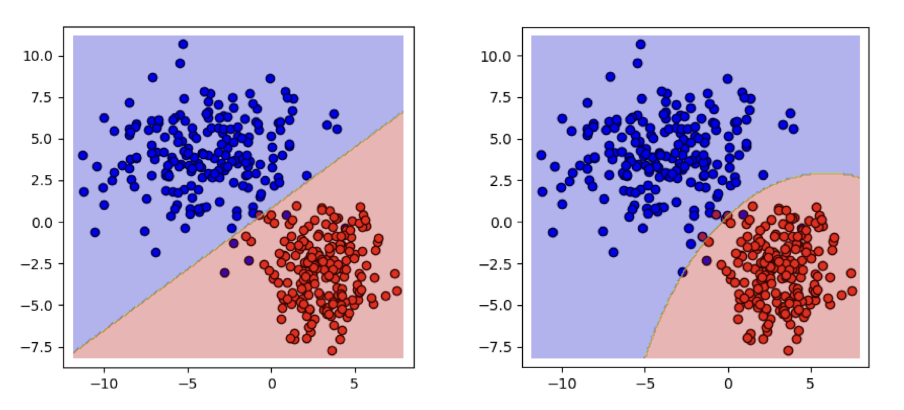

## R Packages for this Lecture

Aside from the packages you have already installed, you will need:

- `discrim` for discriminant analysis
- `naivebayes` for naive Bayes

# The Big Picture {background-color="#40666e"}

## Is This Person a Librarian?

::::: columns
::: {.column width="40%"}
{fig-align="left"}
:::

::: {.column width="60%"}
Ask yourself these questions:

1.  How common are librarians in the first place? (Base rate)

2.  How probable are the features in the picture given that someone is a librarian?

    - The book stack

    - The stern look

    - The glasses

    - The shushing $\ldots$
:::
:::::

## Classification as Belief Updating

- Treat the classification as a Bayesian belief-updating problem.

- We have a [**prior**]{.alert}---the base rate.

- We have [**data**]{.alert}---the attributes shown in the image.

- We can now derive a [**posterior**]{.alert} for each of a set of classes.

## Probabilistic Learning

- Probabilistic learners apply the rules of probability calculus to form predictions.

- They are typically applied to classification tasks.

- They return probabilities in lieu of class labels.

# Bayes' Theorem {background-color="#40666e"}

## Some Rules of Probability Calculus

::::: columns
::: {.column width="50%"}
{fig-align="center"}
:::

::: {.column width="50%"}
-   The joint probability is the probability that events X and C both hold true.

-   This can be written as

    $$
    \Pr (X \cap C) = \Pr (C|X) \cdot \Pr (X)
    $$

-   We can also write

    $$
    \Pr (C|X) = \frac{\Pr(X \cap C)}{\Pr (X)}
    $$
:::
:::::

## The Bayesian Insight

::::: columns
::: {.column width="60%"}
[**Bayes' theorem**]{.alert} states that $$
\Pr (C|X) = \frac{\Pr (X|C) \cdot \Pr (C)}{\Pr (X)}
$$ where:

-   $\Pr (C)$ is the prior probability of observing $C$.

-   $\Pr(X|C)$ is the likelihood (data).

-   $\Pr(X)$ is the marginal likelihood.

-   $\Pr (C|X)$ is the posterior probability.
:::

::: {.column width="40%"}

:::
:::::

## The Bayesian Kernel

-   $\Pr (X)$ is a normalizing constant that we can sometimes ignore.

-   In that case, Bayes' theorem can also be written as $\Pr (C|X) \propto \Pr(X|C) \cdot \Pr(C)$.

-   We shall use this shortcut because it simplifies things.

-   It suffices if the goal is to predict a class; for class *probabilities*, $\Pr(X)$ has to be taken into account.

## Application to Classification

-   Let $\Pr(\text{Librarian})$ be the prior probability of encountering a librarian (the base rate).

-   Let $X = \text{Books}$ and let $\Pr (\text{Books}|\text{Librarian})$ be the probability of seeing books in the vicinity of a librarian.

-   Then, $\Pr(\text{Librarian}|\text{Books}) \propto \Pr(\text{Books}|\text{Librarian}) \cdot \Pr(\text{Librarian})$.

-   This is the foundation of the naive Bayes classifier.

# The Naive Bayes Classifier for Discrete Features {background-color="#40666e"}

## A First Example with Discrete Predictive Features

|                  | HDI Low | HDI Medium | HDI High | HDI Very High |
|------------------|--------:|-----------:|---------:|--------------:|
| Authoritarian    |      14 |         14 |       12 |             9 |
| Hybrid           |      11 |         11 |        6 |             0 |
| Flawed Democracy |       1 |          7 |        9 |            17 |
| Full Democracy   |       0 |          0 |        0 |            16 |

-   We are interested in the class "Flawed Democracy".

-   We observe a high HDI.

-   $\Pr(\text{Flawed Dem}) = 47/123 = 0.268$.

-   $\Pr(\text{HDI High}|\text{Flawed Dem}) = 0.265$.

-   Then $\Pr(\text{Flawed Dem}|\text{HDI High}) \propto 0.265 \cdot 0.268 \propto 0.071$.

## MAP

The class prediction is based on the [**maximum a posteriori**]{.alert} (MAP) probability:

$$
    \begin{split}
    \text{MAP} &= \max_j \Pr(y = j|\boldsymbol{x}) \\
    &= \max_j \frac{\Pr(\boldsymbol{x}|y = j) \cdot \Pr(y = j)}{\Pr (\boldsymbol{x})} \\
    &= \max_j \Pr(\boldsymbol{x}|y = j) \cdot \Pr(y = j)
    \end{split}
    $$ {#eq-map}

## Illustration

- $\Pr(\text{Au}) = 0.386 \times \Pr(\text{High}|\text{Au}) = 0.245 = 0.094$ $\Leftarrow$ MAP
- $\Pr(\text{Hy}) = 0.220 \times \Pr(\text{High}|\text{Hy}) = 0.214 = 0,047$
- $\Pr(\text{Fl}) = 0.268 \times \Pr(\text{High}|\text{Fl}) = 0.265 = 0.071$
- $\Pr(\text{Fu}) = 0.126 \times \Pr(\text{High}|\text{Fu}) = 0.000 = 0.000$

## Multiple Discrete Features

|             | Low Literacy |       |       |        | High Literacy |       |       |        |
|-------------|-------------:|------:|------:|-------:|--------------:|------:|------:|-------:|
| **HDI -\>** |        **L** | **M** | **H** | **VH** |         **L** | **M** | **H** | **VH** |
| A           |           18 |    12 |     5 |      1 |             0 |     4 |     9 |      8 |
| H           |           11 |    12 |     1 |      0 |             0 |     0 |     7 |      2 |
| Flawed      |            1 |     6 |     3 |      1 |             0 |     1 |    10 |     21 |
| Full        |            0 |     0 |     0 |      1 |             0 |     1 |     0 |      5 |

-   So far $\boldsymbol{x} = x$, i.e., a single feature.

-   Typically, $\boldsymbol{x}$ is of dimensionality $P \gg 1$.

-   Then, the procedure outlined so far would entail a multi-way cross-tabulation between all of the features and the labels.

-   This results in many cells, many of which will be empty.

## The Simple Beauty of Naivety

-   Let us assume that all predictive features are statistically independent.

-   In this case,

    $$
    \begin{split}
    \Pr(y=j|\boldsymbol{x}) &\propto \Pr(y = j) \cdot \Pr(\boldsymbol{x}|y = j) \\
    &\propto \Pr(y = j) \prod_{i=1}^P \Pr(x_i|y = j)
    \end{split}
    $$

-   We call this the [**naive Bayes classifier**]{.alert}.

-   It is computationally simple and, despite the unrealistic assumption, often remarkably good at prediction.

## A Common Complication

|        | Low | Medium | High | Very High |
|--------|----:|-------:|-----:|----------:|
| A      |  14 |     14 |   12 |         9 |
| H      |  11 |     11 |    6 |         0 |
| Flawed |   1 |      7 |    9 |        17 |
| Full   |   0 |      0 |    0 |        16 |

Empty cells can result in counter-intuitive results:

-   All features point to full democracy.

-   We now add a feature that produces an empty cell for full democracies.

-   Suddenly it is impossible to classify an instance as a full democracy

## Laplacian Smoothing

-   We turn the zero-conditional probability into a small positive number.

-   We compute

    $$
    q_{ij} = \frac{f_{ij} + \alpha}{n_{1j} + \alpha \cdot M}
    $$ where

    1.  $f_{ij}$ is the number of instances with value $i$ on $x$ and $y = j$.

    2.  $n_{1j}$ is the number of training instances with class $y = j$.

    3.  $\alpha \geq 0$ is a smoothing parameter.

    4.  $M$ is the number of classes.

-   Often we choose $\alpha = 1$, which results in add-one smoothing.

-   More typically, we tune $\alpha$.

## Bypassing Naivety

-   There is work that seeks to alleviate independence through weighting [@zaidi2013Alleviating].

-   Implementation in `tidymodels` is not straightforward, but there is a package: `bnclassify`.

-   Given that naive Bayes often makes very good predictions, I have not yet seen many applications of the updated classifier.

# The Naive Bayes Classifier for Continuous Features {background-color="#40666e"}

## Going Continuous

With numeric predictive features, we can write the naive Bayes classifier as

$$
\Pr(y = j|\boldsymbol{x}) \propto \Pr(y = j) \cdot \prod_{i=1}^P p(x_i|y = j)
$$

where $p(.)$ denotes a probability density function or pdf.

## Going Gaussian

Sometimes, the pdf is specified to be the normal or Gaussian pdf:

$$
p(x_i|y = j) = \frac{1}{\sqrt{2 \pi \sigma_{ij}^2}} \exp \left \{ -\frac{1}{2} \frac{(x_i - \mu_{ij})^2}{\sigma_{ij}^2} \right \}
$$

where

-   $\mu_{ij}$ is the mean of feature $i$ in class $j$.

-   $\sigma_{ij}$ is the standard deviation of feature $i$ in class $j$.

## Decision Boundary

{fig-align="center"}

The decision boundary is a hyper-surface that partitions the feature space into a set of classes. Illustrated here for a 2-class problem.

## Prediction

{fig-align="center"}

## Using Kernels

-   Not everyone likes to use the normal distribution.

-   Two liabilities are:

    -   This prevents us from introducing categorical predictive features

    -   Many predictive features simply are not normally distributed

-   An alternative is to rely on kernel density estimates of the predictive features.

-   The kernel smoothness (bandwidth) is another tuning parameter.


# Performance in Classification—Take 2 {background-color="#40666e"}

## Working with Probabilities

-  Naive Bayes outputs are class *probabilities*, not labels.
-  We can assess performance in terms of class probabilities, too.
-  For 2-class problems, AUC is a great tool.

## The ROC Space

::::: columns
::: {.column width="40%"}
```{r}
# Load required libraries
library(ggplot2)
library(viridis)  # Colorblind-friendly colors
library(ggrepel)  # For better label positioning

# Define colorblind-friendly colors (similar to your TikZ colors)
color1 <- "#E69F00"  # Alternative to FDB462 (Orange)
color2 <- "#0072B2"  # Alternative to 386CB0 (Blue)
color3 <- "#009E73"  # Alternative to 40826D (Green)

# Define the main ROC diagonal line
roc_data <- data.frame(
  FP = c(0, 1),
  TP = c(0, 1)
)

# Define the key points
points_data <- data.frame(
  FP = c(0.15, 0.4, 0.8),
  TP = c(0.85, 0.5, 0.8),
  Label = c("A", "B", "C")
)

# Define the additional point at (0,1)
special_point <- data.frame(
  FP = 0,
  TP = 1
)

# Create the ROC plot
ggplot() +
  # Add diagonal line (random classifier)
  geom_line(data = roc_data, aes(x = FP, y = TP), color = color3, size = 1.5) +
  
  # Add key points (A, B, C) with 'x' markers
  geom_point(data = points_data, aes(x = FP, y = TP), color = color1, shape = 4, size = 7, stroke = 2) +
  geom_text_repel(data = points_data, aes(x = FP, y = TP, label = Label), nudge_y = -0.05, size = 6) +
  
  # Add the special point (0,1) with a filled circle
  geom_point(data = special_point, aes(x = FP, y = TP), color = color2, shape = 21, fill = color2, size = 4) +
  
  # Labels and theme
  labs(
    title = "ROC Curve",
    x = "False Positive Rate (FP)",
    y = "True Positive Rate (TP)"
  ) +
  theme_minimal(base_size = 14) +
  theme(panel.grid = element_blank())  # Remove grid for a cleaner look

```
:::

::: {.column width="60%"}
-   ROC = receiver operating characteristic.

-   The ROC space shows

    1.  1 - specificity or the false positive rate on the $x$-axis.

    2.  sensitivity or the true positive rate on the $y$-axis.

-   The ideal classifier has FP = 0 and TP = 1 (blue circle).

-   By chance, we would expect FP = TP (green line).

-   The better the classifier, the closer it is to the ideal.
:::
:::::

## Probability Thresholds and the ROC Space

-   When an algorithm generates probabilities, these can be translated into classes by setting thresholds.

-   Denote the classes by $y = 0$ and $y = 1$, respectively. Then, for some threshold $\tau \in [0,1]$,

    $$
    y_i = \boldsymbol{1}(\pi_i \geq \tau)
    $$

-   Each choice of $\tau$, we obtain an FP and a TP rate, which allows us to plot a point in the ROC space.

## Illustration

::: panel-tabset
### Data

```{r}
#| echo: false
y <- c(rep(0,5), rep(1,4))
probs <- c(0.05, 0.15, 0.20, 0.30, 0.40, 0.55, 0.75, 0.90, 0.95)
X <- rbind(y, probs)
row.names(X) <- c("y", "Prob")
X
```

### Cut at 0.1

```{r}
#| echo: false
#| message: false
library(caret)
yhat <- ifelse(X[2,]>=0.1, 1, 0)
mytable <- table(yhat,X[1,])
temp <- confusionMatrix(mytable, positive = "1")
temp$table
```

TP = `r round(temp$byClass[1], 3)`

FP = `r round(1 - temp$byClass[2], 3)`

### Cut at 0.5

```{r}
#| echo: false
yhat <- ifelse(X[2,]>=0.5, 1, 0)
mytable <- table(yhat,X[1,])
temp <- confusionMatrix(mytable, positive = "1")
temp$table
```

TP = `r round(temp$byClass[1], 3)`

FP = `r round(1 - temp$byClass[2], 3)`
:::

## The ROC Curve and Area Under the Curve

::::: columns
::: {.column width="50%"}
-   Lining up the combinations $(\text{FP},\text{TP})$ generates a curve known as the ROC curve.

-   We are interested in the area under this curve or the AUC.

-   For an ideal classifier, AUC = 1.

-   For a classifier that performs no better than chance, AUC = 0.5.

-   Be careful using this in small samples [@hanczar2010SmallSample].
:::

::: {.column width="50%"}
```{r}
#| echo: false
library(pROC)
N <- 1000
x <- runif(N, 0, 10)
e <- rlogis(N, 0, 1)
ystar <- -2 + x + e
y <- ifelse(ystar >= 0, 1, 0)
glm.fit <- glm(y ~ x, family = "binomial")
glm.pred <- predict(glm.fit, type = "response")
roc <- pROC::roc(y, glm.pred)
plot(smooth(roc), col = "#386cb0", print.auc = TRUE)
```
:::
:::::

# Naive Bayes in `tidymodels` {background-color="#40666e"}

## Predicting Democracy

::: panel-tabset
### Data

```{r}
#| echo: true
#| message: false
library(rio)
library(tidyverse)
world22_df <- import("Data/world22.xlsx")
work_df <- tibble(world22_df) |>
  column_to_rownames(var = "COUNTRY") |>
  filter(!is.na(REGIME)) %>%
  mutate(DEMOCRACY = ifelse(REGIME=="Flawed Democracy"|
                              REGIME=="Full Democracy", 1, 2),
         DEMOCRACY = factor(DEMOCRACY, labels = c("Democracy", "Other")),
         LOGPCGDP = log10(GDPPERCAP)) %>%
  select(DEMOCRACY, POP21, LITERACY, HDI21, LOGPCGDP, GDPGROWTH, GINI,
         EFIDX, STABILITY, GOVEFF, RULEOFLAW)
```

### Split

```{r}
#| echo: true
#| message: false
library(tidymodels)
tidymodels_prefer()
set.seed(10)
demo_split <- initial_split(work_df, prop = 0.75, strata = DEMOCRACY)
demo_train <- training(demo_split)
demo_test <- testing(demo_split)
```

### Recipe

```{r}
#| echo: true
# We add imputation of missing values
bayes_recipe <- recipe(DEMOCRACY ~ ., data = demo_train) |>
  step_impute_knn(neighbors = 3)
```

### Model+Flow

```{r}
#| echo: true
library(discrim)
bayes_spec <- naive_Bayes(smoothness = tune(),
                          Laplace = tune()) |>
  set_mode("classification") |>
  set_engine("naivebayes")
initial_flow <- workflow() |>
  add_model(bayes_spec) |>
  add_recipe(bayes_recipe)
```

### Grid

```{r}
#| echo: true
bayes_par <- extract_parameter_set_dials(bayes_spec)
set.seed(20)
bayes_grid <- grid_space_filling(
  bayes_par, 
  size = 50,
  type = "latin_hypercube"
)
```

### CV

```{r}
#| echo: true
set.seed(30)
cv_folds <- vfold_cv(demo_train, v = 10, repeats = 5)
```
:::

## Tuning Naive Bayes in `tidymodels`

::: panel-tabset
### Metric

```{r}
#| echo: true
bayes_metrics <- metric_set(roc_auc)
```

### Results

```{r}
#| echo: true
#| eval: false
library(future)
library(doFuture)
plan(multisession, workers = parallelly::availableCores())
registerDoFuture()
bayes_tune <- initial_flow |>
  tune_grid(cv_folds, grid = bayes_grid, metrics = bayes_metrics)
autoplot(bayes_tune) +
  theme_light() +
  labs(title='Hyperparameter Tuning for Naive Bayes')
plan(sequential)
```

### Plot

```{r}
library(future)
library(doFuture)
plan(multisession, workers = parallelly::availableCores())
registerDoFuture()
bayes_tune <- initial_flow |>
  tune_grid(cv_folds, grid = bayes_grid, metrics = bayes_metrics)
autoplot(bayes_tune) +
  theme_light() +
  labs(title='Hyperparameter Tuning for Naive Bayes')
plan(sequential)
```

### Summary

```{r}
#| echo: true
collect_metrics(bayes_tune, summarize = TRUE)
```

### Optimal

```{r}
#| echo: true
select_best(bayes_tune)
```
:::

## Prediction with Naive Bayes in `tidymodels`

::: panel-tabset
### Finalize

```{r}
#| echo: true
bayes_updated <- finalize_model(bayes_spec,
                                select_best(bayes_tune))
workflow_new <- initial_flow |>
  update_model(bayes_updated)
new_fit <- workflow_new |>
  fit(data = demo_train)
```

### Predict

```{r}
#| echo: true
demo_test <- 
  predict(new_fit, demo_test, type = "prob") |>
  bind_cols(demo_test)
demo_test |>
  roc_auc(DEMOCRACY, .pred_Democracy)
```
:::

# Performance in Classification—Take 3 {background-color="#40666e"}

## Log-Loss

-   Imagine we have $M$ categories that are being predicted.

-   For each category $j$ and each instance $i$, we obtain a predicted probability $\pi_{ij}$ .

-   We can now define a **log-loss** performance metric (a.k.a. cross-entropy):

    $$
    \text{lnL} = - \sum_{i=1}^{n_2} \sum_{j=1}^M y_{ij} \cdot \ln \pi_{ij}
    $$

-   The lowest value this can take is 0.

-   Sometimes, the log-loss is converted to a *mean* log-loss through division by $n_2$.

## The Tribulations of a Betting Person

-   Imagine we predict membership in $j$ with $\pi_j = 1$; we are certain of our guess. If $y = j$ and $y_j = 1$, then lnL is 0. Perfect!

-   Had we just barely favored $j$, e.g., by setting $\pi_j = 0.501$, then we would have incurred a loss: lnL = 0.691.

-   However, it also works the other way around:

    -   We are certain of $j$ but in actuality $k$ occurs $\Rightarrow$ high loss

    -   We are barely opting for $j$ and in actuality $k$ occurs $\Rightarrow$ lower loss

# Discriminant {background-color="#40666e"}

## Generalizing Gaussian Naive Bayes

-   Assume the predictive features follow the $P$-variate normal distribution

    $$
    p(\boldsymbol{x}|y = j) = \frac{\exp \left[ -\frac{1}{2} (\boldsymbol{x} - \boldsymbol{\mu}_j)^\top \boldsymbol{\Sigma}_j^{-1} (\boldsymbol{x} - \boldsymbol{\mu}_j) \right]}{\sqrt{(2\pi)^P \lvert \boldsymbol{\Sigma}_j \rvert}}
    $$ where

    -   $\boldsymbol{\mu}_j$ is a vector of feature means for class $j$.

    -   $\boldsymbol{\Sigma}_j$ is the variance-covariance matrix for the features in class $j$.

    -   $|.|$ denotes the determinant.

## Generalizing Gaussian Naive Bayes Cont'd

-   Gaussian naive Bayes is the special case, where we assume all covariances among the features to be 0.

-   However, there are other models making different assumptions; these generally go under the name of [**discriminant analysis**]{.alert}.

## Multivariate Normality

::::: columns
::: {.column width="\"50%"}
{fig-align="center"}
:::

::: {.column width="50%"}
{fig-align="center"}
:::
:::::

## Overview

| Method | Means | VC-Matrix | Parameters |
|----|----|----|----|
| Gaussian Naive Bayes | Vary by class | Diagonal | $2MP + M - 1$ |
| Linear Discriminant | Vary by class | Constant across classes (i.e., pooled) | $MP + .5P(P+1) + M - 1$ |
| Quadratic Discriminant | Vary by class | Vary by class | $MP + .5MP(P+1) + M -1$ |

## Linear Discriminant Method

-   The idea goes back to @fisher1936Use.

-   The posterior probability of instance $i$ belonging to class $j$ is

    $$
    \begin{align}
    \Pr(y_i = j|\boldsymbol{x}_i) \propto& \Pr(y_i = j) \cdot \\
    &(2\pi)^{-.5P} \cdot \lvert \boldsymbol{\Sigma} \rvert^{-.5} \cdot\exp \left[ -\frac{1}{2} (\boldsymbol{x}_i - \boldsymbol{\mu}_j)^\top \boldsymbol{\Sigma}^{-1} (\boldsymbol{x}_i - \boldsymbol{\mu}_j) \right]
    \end{align}
    $$

-   The class means and pooled variance-covariance matrix are estimated using maximum likelihood.

-   Classes are determined based on the MAP.

## What Is Linear about This?

-   The decision boundary between classes $j$ and $k$ is $\Pr(y=j|\boldsymbol{x}) = \Pr(y=k|\boldsymbol{x})$ or

    $$
    \ln \left( \frac{\Pr(y=j|\boldsymbol{x})}{\Pr(y=k|\boldsymbol{x})} \right) = 0
    $$

-   Substituting the posterior formulas and rearranging terms yields

    $$
    (\boldsymbol{\mu}_j - \boldsymbol{\mu}_k)^\top \boldsymbol{\Sigma}^{-1} \boldsymbol{x} = c + \frac{1}{2} \left( \boldsymbol{\mu}_j^\top \boldsymbol{\Sigma}^{-1} \boldsymbol{\mu}_j - \boldsymbol{\mu}_k^\top \boldsymbol{\Sigma}^{-1} \boldsymbol{\mu}_k \right)
    $$ where $c$ is a constant based on the differences in the log-priors.

-   This is of the form $\boldsymbol{b}^\top \boldsymbol{x} = a$ or a linear function.

## Prediction Using Linear Scores

-   We know that $\ln \Pr(y=j|\boldsymbol{x}) \propto \ln \Pr(y=j) + \ln p(\boldsymbol{x}|y=j)$.

-   With some math, the right-hand side becomes

    $$
    \ln \Pr(y=j) - \frac{P}{2} \ln \pi - \frac{1}{2} \ln \lvert \boldsymbol{\Sigma} \rvert - \frac{1}{2} \boldsymbol{\mu}_j^\top \boldsymbol{\Sigma}^{-1} \boldsymbol{\mu}_j + \boldsymbol{\mu}_j^\top \boldsymbol{\Sigma}^{-1} \boldsymbol{x}
    $$

-   Dropping all of the terms that do not vary in $j$, we obtain the **linear score** function

    $$
    s_j = -\frac{1}{2} \boldsymbol{\mu}_j^\top \boldsymbol{\Sigma}^{-1} \boldsymbol{\mu}_j + \boldsymbol{\mu}_j^\top \boldsymbol{\Sigma}^{-1} \boldsymbol{x} + \ln \Pr(y = j)
    $$

-   We assign to whichever category has the highest score.

-   The term $d_j^\top = \boldsymbol{\mu}_j^\top \boldsymbol{\Sigma}^{-1}$ is known as the vector of **discriminant parameters**.

## Fitting a Linear Discriminant Model in `tidymodels`

::: panel-tabset
### Data

```{r}
#| echo: true
work_df <- tibble(world22_df) |>
  column_to_rownames(var = "COUNTRY") |>
  filter(!is.na(REGIME)) |>
  mutate(REGIME = as.factor(REGIME),
         LOGPCGDP = log10(GDPPERCAP)) |>
  select(REGIME, HDI21, LOGPCGDP, GINI, EFIDX, RULEOFLAW)
```

### Split

```{r}
#| echo: true
set.seed(1451)
regime_split <- initial_split(work_df, prop = 0.75, strata = "REGIME")
regime_train <- training(regime_split)
regime_test <- testing(regime_split)
```

### Recipe

```{r}
#| echo: true
lda_recipe <- recipe(REGIME ~ ., data = regime_train) |>
   step_impute_knn(neighbors = 3)
```

### Model

```{r}
#| echo: true
lda_spec <- discrim_linear(penalty = NULL, regularization_method = NULL) |>
  set_mode("classification") |>
  set_engine("MASS")
```

### Fit

```{r}
#| echo: true
lda_flow <- workflow() |>
  add_recipe(lda_recipe) |>
  add_model(lda_spec)
regime_fit <- fit(lda_flow, regime_train)
```

### Res 1

```{r}
#| echo: true
regime_fit$fit$fit$fit$prior
```

### Res 2

```{r}
#| echo: true
regime_fit$fit$fit$fit$means
```

### Res 3

```{r}
#| echo: true
regime_fit$fit$fit$fit$scaling
```
:::

## Evaluating LDA in `tidymodels`

```{r}
#| echo: true
#| warning: false
regime_test <- 
  predict(regime_fit, regime_test, type = "prob") |>
  bind_cols(regime_test)
regime_test |>
  mn_log_loss(REGIME, 1:4)
```

## Quadratic Discriminant Analysis

-   In quadratic discriminant analysis, we allow both the means and variance-covariance matrices to vary by class.

-   This results in a quadratic boundary function:

    $$
    (\boldsymbol{x} - \boldsymbol{\mu}_j)^\top \boldsymbol{\Sigma}_j^{-1} (\boldsymbol{x} - \boldsymbol{\mu}_j) - (\boldsymbol{x} - \boldsymbol{\mu}_k)^\top \boldsymbol{\Sigma}_k^{-1} (\boldsymbol{x} - \boldsymbol{\mu}_k) = k
    $$

-   Here,

    $$
    k = 2 \left[\ln \Pr(y = j) - \ln \Pr(y = k) \right] + \ln \lvert \boldsymbol{\Sigma}_k \rvert - \ln \lvert \boldsymbol{\Sigma}_j \rvert
    $$
    
## Comparison with LDA

{fig-align="center"}
::: {style="font-size: 75%"}
**Source:** @ghojogh2019Linear [p. 11]
:::

## QDA in `tidymodels`

::: panel-tabset
### Model+Fit

```{r}
#| echo: true
library(discrim)
qda_spec <- discrim_quad(regularization_method = NULL) %>%
  set_mode("classification") %>%
  set_engine("MASS")
qda_flow <- workflow() %>%
  add_recipe(lda_recipe) %>%
  add_model(qda_spec)
regime_fit <- fit(qda_flow, regime_train)
```

### Results

```{r}
#| echo: true
regime_fit$fit$fit$fit
```

### Prediction

```{r}
#| echo: true
regime_test <- 
  predict(regime_fit, regime_test, type = "prob") %>%
  bind_cols(regime_test)
regime_test %>%
  mn_log_loss(REGIME, 1:4)
```
:::    


## References